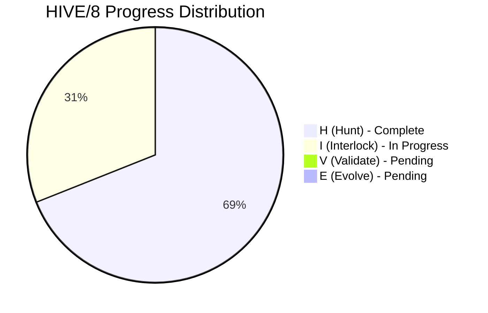
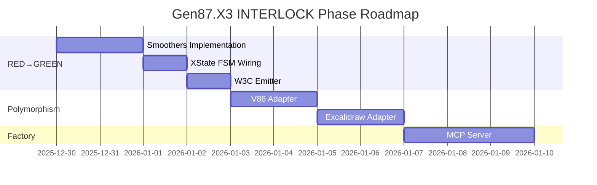
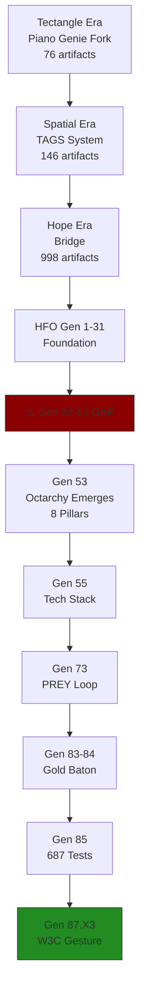

# Gen87.X3 Executive Summary — Ground Truth

> **Timestamp**: 2025-12-30T22:30:00Z  
> **Generation**: 87.X3 | **HIVE Phase**: I (INTERLOCK) | **TDD**: RED  
> **PDCA Cycle**: DO | **Mission Fit**: 6.5/10 → Target 9.5/10  
> **Reading Time**: 3 minutes

---

## 🎯 BLUF (Bottom Line Up Front)

**WHAT**: Building a **Task Factory** for composable gesture-to-anything pipelines. W3C Pointer Events is the **testbed**, not the product.

**WHERE**: HIVE/8 **INTERLOCK (I)** phase = TDD **RED** phase. 229 failing tests ready for implementation.

**STATUS**: 506 tests total (229 RED / 270 GREEN / 7 SKIP). Architecture validated at 9/10. Hexagonal CDD enforced.

---

## 📊 Current State Dashboard

```
┌─────────────────────────────────────────────────────────────────────────────┐
│                    GEN87.X3 GROUND TRUTH - 2025-12-30                        │
├────────────────────────────────┬────────────────────────────────────────────┤
│ HIVE/8 Phase                   │ 🔴 INTERLOCK (I) - TDD RED                  │
│ PDCA Cycle                     │ 📌 DO (Plan→DO→Check→Act)                   │
│ Mission Fit Score              │ ⚡ 6.5/10 → Target 9.5/10                   │
│ Architecture Grade             │ ✅ 9/10 (Hexagonal CDD)                     │
├────────────────────────────────┼────────────────────────────────────────────┤
│ Tests Total                    │ 506                                         │
│ 🔴 RED (Failing)               │ 229 (45%)                                   │
│ 🟢 GREEN (Passing)             │ 270 (53%)                                   │
│ ⏭️ SKIP                        │ 7 (2%)                                      │
├────────────────────────────────┼────────────────────────────────────────────┤
│ Spec Documents                 │ 16 specs                                    │
│ Test Files                     │ 19 files                                    │
│ Blackboard Signals             │ 103 signals                                 │
│ HFO Lineage Artifacts          │ 6,423 in Memory Bank                        │
└────────────────────────────────┴────────────────────────────────────────────┘
```

---

## 🏗️ Pipeline Architecture

```mermaid
flowchart LR
    subgraph SENSOR["Stage 1: SENSOR"]
        MP[MediaPipe Tasks Vision]
    end
    
    subgraph SMOOTHER["Stage 2: SMOOTHER"]
        OE[1€ Filter]
        RP[Rapier Physics]
        KF[Kalman]
    end
    
    subgraph FSM["Stage 3: FSM"]
        XS[XState v5]
    end
    
    subgraph EMITTER["Stage 4: EMITTER"]
        W3C[W3C Pointer Events L3]
    end
    
    subgraph TARGET["Stage 5: TARGET"]
        DOM[DOM Element]
        V86[v86 Emulator]
        EXC[Excalidraw]
        PUT[Puter.js]
    end
    
    SENSOR --> SMOOTHER --> FSM --> EMITTER --> TARGET
    
    style SENSOR fill:#2d5a27,stroke:#333
    style SMOOTHER fill:#1e4d2b,stroke:#333
    style FSM fill:#0f3b21,stroke:#333
    style EMITTER fill:#5a2d27,stroke:#333
    style TARGET fill:#4d1e2b,stroke:#333
```



---

## 📈 Progress by Phase



| HIVE Phase | TDD Phase | Ports | Status | Progress |
|------------|-----------|-------|--------|----------|
| **H (Hunt)** | Research | 0+7 | ✅ Complete | 100% |
| **I (Interlock)** | RED | 1+6 | 🔴 **IN PROGRESS** | 45% |
| V (Validate) | GREEN | 2+5 | ⏳ Pending | 0% |
| E (Evolve) | REFACTOR | 3+4 | ⏳ Pending | 0% |

---

## ✅ What's Working (Completed)

| Component | Status | Evidence |
|-----------|--------|----------|
| Hexagonal CDD Architecture | ✅ 9/10 | 5 ports with Zod contracts |
| TRL 9 Exemplar Selection | ✅ Done | MediaPipe, 1€, XState, W3C |
| Golden Layout Demo | ✅ Working | Commit 84dbc65 |
| Architecture Enforcement | ✅ Active | 6 detectors, pre-commit |
| Memory Bank Integration | ✅ 6,423 artifacts | FTS search operational |

---

## ❌ What's Missing (Blockers)

| Gap | Impact | Priority |
|-----|--------|----------|
| 229 RED tests need GREEN | V-phase blocked | 🔴 HIGH |
| Only 1 adapter per port | Polymorphism unproven | 🔴 HIGH |
| No MCP Server | AI can't invoke factory | 🟡 MEDIUM |
| No MAP-Elites | No quality diversity | 🟡 MEDIUM |
| No Temporal workflows | No durability | 🟢 LOW |

---

## 🎯 Next Actions (This Session)



**Immediate**:
1. ⬜ Make OneEuroSmoother GREEN (stub → implementation)
2. ⬜ Make SpringDamperSmoother GREEN
3. ⬜ Wire XState FSM with full state transitions

**This Week**:
4. ⬜ Implement V86Adapter (proves target polymorphism)
5. ⬜ Convert 50 stub tests to `.todo()`

---

## 🧬 HFO Lineage (How We Got Here)



---

## 📡 Key Signals from Blackboard

| Timestamp | Phase | Signal |
|-----------|-------|--------|
| 2025-12-30T19:12 | I | TDD RED complete: 185 RED / 79 GREEN |
| 2025-12-30T18:45 | H | Golden Layout demo working (84dbc65) |
| 2025-12-30T17:54 | V | FSM falsy-0 bug fixed, 79 tests GREEN |
| 2025-12-30T12:40 | I | RED suite expanded to 513 tests |

---

## 🔑 The Mantra

> **"The factory creates the pipelines that create the gestures that control the tools that build the factory."**

*This is a strange loop - the system is self-improving.*

---

**Source Documents**:
- [HFO_EVOLUTION_LINEAGE_REPORT.md](HFO_EVOLUTION_LINEAGE_REPORT.md) - Lineage trace
- [GEN87_X3_CONTEXT_PAYLOAD_V1_20251230Z.md](GEN87_X3_CONTEXT_PAYLOAD_V1_20251230Z.md) - Full context
- [W3C_GESTURE_CONTROL_PLANE_VARIANT2_20251230T2100Z.md](W3C_GESTURE_CONTROL_PLANE_VARIANT2_20251230T2100Z.md) - Pipeline spec
- [../hfo_daily_specs/W3C_POINTER_GESTURE_CONTROL_PLANE_20251230.md](../hfo_daily_specs/W3C_POINTER_GESTURE_CONTROL_PLANE_20251230.md) - Daily spec

---

*Gen87.X3 | INTERLOCK Phase | 2025-12-30T22:30:00Z*
