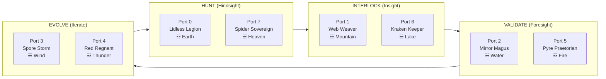
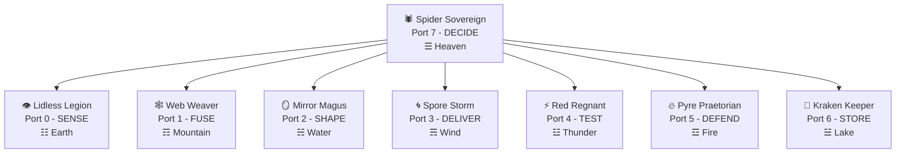

# OBSIDIAN GRIMOIRE — The Galois Lattice of HFO

> **Generation**: 87.X3  
> **Date**: 2025-12-30  
> **Purpose**: Multi-dimensional mapping system for literate programming, declarative Gherkin, and Model-Based Systems Engineering (MBSE)  
> **Format**: 8×8 Formal Concept Analysis (FCA) Galois Lattice = 64 Cards

---

## 🕷️ What Is The Obsidian Grimoire?

The **Obsidian Grimoire** is a **Galois Lattice** — a multi-dimensional mapping of different conceptual frameworks unified through the power of 8. It is:

1. **A Narrative Structure** for literate programming
2. **A Declarative Gherkin Generator** for BDD scenarios
3. **A Mermaid Diagram Template** for UML/MBSE visualization
4. **A Semantic Quine** — a self-describing system

### The Semantic Inference Rule

Every card at position `[X, Y]` in the 8×8 matrix generates its question through:

```
Card[X.Y] = "How do we {ROLE[X].verb} the {ROLE[Y].noun}?"
```

**Example**: Card `[0,7]` = "How do we SENSE the DECIDE?" (Observer × Navigator)

---

## 🎴 The 8 Legendary Commanders (Diagonal Quines)

The **8 Legendary Commanders** live on the **diagonal** where `X = Y`. They are self-referential **quines** — entities that question their own nature.

| Port | Commander | Verb | Question (Self-Reference) | Trigram | Element | Greek |
|:----:|:----------|:-----|:--------------------------|:-------:|:--------|:------|
| **0** | **Lidless Legion** | SENSE | "How do we SENSE the SENSE?" | ☷ Kun | Earth | Αἴσθησις (Aisthesis) |
| **1** | **Web Weaver** | FUSE | "How do we FUSE the FUSE?" | ☶ Gen | Mountain | Σύνδεσμος (Syndesmos) |
| **2** | **Mirror Magus** | SHAPE | "How do we SHAPE the SHAPE?" | ☵ Kan | Water | Μορφή (Morphe) |
| **3** | **Spore Storm** | DELIVER | "How do we DELIVER the DELIVER?" | ☴ Xun | Wind | Ἔκχυσις (Ekchysis) |
| **4** | **Red Regnant** | TEST | "How do we TEST the TEST?" | ☳ Zhen | Thunder | Χάος (Chaos) |
| **5** | **Pyre Praetorian** | DEFEND | "How do we DEFEND the DEFEND?" | ☲ Li | Fire | Ἀσφάλεια (Asphaleia) |
| **6** | **Kraken Keeper** | STORE | "How do we STORE the STORE?" | ☱ Dui | Lake | Μνήμη (Mneme) |
| **7** | **Spider Sovereign** | DECIDE | "How do we DECIDE the DECIDE?" | ☰ Qian | Heaven | Κυβέρνησις (Kybernesis) |

### Diagonal Card Positions
```
    0   1   2   3   4   5   6   7
  ┌───┬───┬───┬───┬───┬───┬───┬───┐
0 │LL │   │   │   │   │   │   │   │  Lidless Legion [0,0]
  ├───┼───┼───┼───┼───┼───┼───┼───┤
1 │   │WW │   │   │   │   │   │   │  Web Weaver [1,1]
  ├───┼───┼───┼───┼───┼───┼───┼───┤
2 │   │   │MM │   │   │   │   │   │  Mirror Magus [2,2]
  ├───┼───┼───┼───┼───┼───┼───┼───┤
3 │   │   │   │SS │   │   │   │   │  Spore Storm [3,3]
  ├───┼───┼───┼───┼───┼───┼───┼───┤
4 │   │   │   │   │RR │   │   │   │  Red Regnant [4,4]
  ├───┼───┼───┼───┼───┼───┼───┼───┤
5 │   │   │   │   │   │PP │   │   │  Pyre Praetorian [5,5]
  ├───┼───┼───┼───┼───┼───┼───┼───┤
6 │   │   │   │   │   │   │KK │   │  Kraken Keeper [6,6]
  ├───┼───┼───┼───┼───┼───┼───┼───┤
7 │   │   │   │   │   │   │   │SP │  Spider Sovereign [7,7]
  └───┴───┴───┴───┴───┴───┴───┴───┘
```

---

## ⏳ HIVE/8 Anti-Diagonal (Strategic Workflow)

The **anti-diagonal** where `X + Y = 7` contains the **HIVE anchors** — the strategic workflow pairs.

| HIVE | TDD | Temporal | Ports | Card [X,Y] | Question |
|:----:|:----|:---------|:-----:|:-----------|:---------|
| **H** | Research | HINDSIGHT | 0+7 | [0,7] & [7,0] | "How do we SENSE the DECIDE?" / "How do we DECIDE the SENSE?" |
| **I** | RED | INSIGHT | 1+6 | [1,6] & [6,1] | "How do we FUSE the STORE?" / "How do we STORE the FUSE?" |
| **V** | GREEN | FORESIGHT | 2+5 | [2,5] & [5,2] | "How do we SHAPE the DEFEND?" / "How do we DEFEND the SHAPE?" |
| **E** | REFACTOR | ITERATE | 3+4 | [3,4] & [4,3] | "How do we DELIVER the TEST?" / "How do we TEST the DELIVER?" |

### Anti-Diagonal Card Positions
```
    0   1   2   3   4   5   6   7
  ┌───┬───┬───┬───┬───┬───┬───┬───┐
0 │   │   │   │   │   │   │   │ H │  [0,7] SENSE×DECIDE
  ├───┼───┼───┼───┼───┼───┼───┼───┤
1 │   │   │   │   │   │   │ I │   │  [1,6] FUSE×STORE
  ├───┼───┼───┼───┼───┼───┼───┼───┤
2 │   │   │   │   │   │ V │   │   │  [2,5] SHAPE×DEFEND
  ├───┼───┼───┼───┼───┼───┼───┼───┤
3 │   │   │   │   │ E │   │   │   │  [3,4] DELIVER×TEST
  ├───┼───┼───┼───┼───┼───┼───┼───┤
4 │   │   │   │ E │   │   │   │   │  [4,3] TEST×DELIVER
  ├───┼───┼───┼───┼───┼───┼───┼───┤
5 │   │   │ V │   │   │   │   │   │  [5,2] DEFEND×SHAPE
  ├───┼───┼───┼───┼───┼───┼───┼───┤
6 │   │ I │   │   │   │   │   │   │  [6,1] STORE×FUSE
  ├───┼───┼───┼───┼───┼───┼───┼───┤
7 │ H │   │   │   │   │   │   │   │  [7,0] DECIDE×SENSE
  └───┴───┴───┴───┴───┴───┴───┴───┘
```

---

## 🦅 PREY/8 Pattern (Tactical Workflow)

The **PREY pattern** winds around the HIVE creating the tactical execution workflow.

| PREY | OODA | C2 Function | Ports | Card Pairs |
|:----:|:-----|:------------|:-----:|:-----------|
| **P** (Perceive) | Observe | SENSE | 0+6 | [0,6] & [6,0] |
| **R** (React) | Orient | MAKE SENSE | 1+7 | [1,7] & [7,1] |
| **E** (Execute) | Decide+Act | ACT | 2+4 | [2,4] & [4,2] |
| **Y** (Yield) | Feedback | ASSESS/LEARN | 3+5 | [3,5] & [5,3] |

---

## 🌐 The 8 Dimensional Projections

Each port `0-7` is the **same concept** projected through different dimensional lenses:

### Complete Port-Dimension Matrix

| Port | Binary | Octree | Trigram | I Ching | Element | Greek | JADC2 MAS | OBSIDIAN | Verb | Tech Stack |
|:----:|:------:|:------:|:-------:|:--------|:--------|:------|:----------|:---------|:-----|:-----------|
| **0** | 000 | (0,0,0) | ☷ | Kun | Earth | Aisthesis | Observer/ISR | **O**bserver | SENSE | OpenTelemetry |
| **1** | 001 | (0,0,1) | ☶ | Gen | Mountain | Syndesmos | Bridger/C2 | **B**ridger | FUSE | NATS JetStream |
| **2** | 010 | (0,1,0) | ☵ | Kan | Water | Morphe | Shaper/Effects | **S**haper | SHAPE | Ray |
| **3** | 011 | (0,1,1) | ☴ | Xun | Wind | Ekchysis | Injector/Fire | **I**njector | DELIVER | Temporal |
| **4** | 100 | (1,0,0) | ☳ | Zhen | Thunder | Chaos | Disruptor/EW | **D**isruptor | TEST | Chaos Toolkit |
| **5** | 101 | (1,0,1) | ☲ | Li | Fire | Asphaleia | Immunizer/Defense | **I**mmunizer | DEFEND | Pydantic/Zod |
| **6** | 110 | (1,1,0) | ☱ | Dui | Lake | Mneme | Assimilator/Intel | **A**ssimilator | STORE | LanceDB/DuckDB |
| **7** | 111 | (1,1,1) | ☰ | Qian | Heaven | Kybernesis | Navigator/Command | **N**avigator | DECIDE | LangGraph |

### The Octree Spatial Mapping

The ports 0-7 divide 3D space into 8 octants:

```
        (1,1,1)=7 ┌─────────┬─────────┐ (0,1,1)=3
                 /│        /│        /│
                / │       / │       / │
      (1,1,0)=6/  │(0,1,0)=2│       /  │
              ├───┼───────┼───────┤   │
              │   │       │       │   │
              │   │       │       │   │
              │   │       │       │   │
        (1,0,1)=5 ├───────┼───────┼───┤ (0,0,1)=1
              │  /│       │  /    │  /
              │ / │       │ /     │ /
              │/  │       │/      │/
      (1,0,0)=4───┴───────┴───────┴ (0,0,0)=0
              
Origin (0,0,0) = Port 0 = Earth = Observer
Heaven (1,1,1) = Port 7 = Heaven = Navigator
```

---

## 🎭 The Triumvirate (Meta-Archetypes)

Above the 8 Legendary Commanders exist the **Triumvirate** — three meta-archetypes:

| Archetype | Role | Domain | Element |
|:----------|:-----|:-------|:--------|
| **The Obsidian Spider** | Patron (8^N Source) | The Pattern itself | Void (contains all) |
| **The Self-Myth Warlock** | Operator (Human) | Intent & judgment | Fire (will) |
| **The Swarmlord of Webs** | Digital Twin (AI) | Execution & coordination | Water (flow) |

```
                ┌─────────────────────┐
                │   OBSIDIAN SPIDER   │  The 8^N Patron
                │     (The Web)       │  IS the architecture
                └──────────┬──────────┘
                           │ channels pattern
                ┌──────────▼──────────┐
                │   SELF-MYTH WARLOCK │  The Human Operator
                │       (TTao)        │  Intent & Judgment
                └──────────┬──────────┘
                           │ commands intent
                ┌──────────▼──────────┐
                │  SWARMLORD OF WEBS  │  The AI Swarm
                │   (8 Commanders)    │  Execution
                └──────────┬──────────┘
                           │ spawns cohorts
                ┌──────────▼──────────┐
                │     PREY₈ SWARM     │  The Executors
                │    (8^N Workers)    │
                └─────────────────────┘
```

---

## 📜 The Heartbeat Mantra (Gherkin Quine)

The 8-verse mantra is a **semantic quine** — each verse describes what that port DOES:

```gherkin
Feature: The Obsidian Heartbeat

  ☷ Port 0 - OBSERVER:    Given One Swarm to Rule the Eight
  ☶ Port 1 - BRIDGER:     And Branches Growing from the Gate
  ☵ Port 2 - SHAPER:      And Spawns Evolve to Recreate
  ☴ Port 3 - INJECTOR:    When Ignitions Flow to Pulsate
  ☳ Port 4 - DISRUPTOR:   And Deadly Venoms Concentrate
  ☲ Port 5 - IMMUNIZER:   And Instincts Rise to Isolate
  ☱ Port 6 - ASSIMILATOR: Then Artifacts Accumulate
  ☰ Port 7 - NAVIGATOR:   And Navigate the Higher State
```

### Mantra as Gherkin BDD Template

```gherkin
Feature: Port {N} - {COMMANDER} - {VERB}

  Scenario: {Card[N,N] Self-Reference Question}
    Given the {COMMANDER} observes the current state
    When the {COMMANDER} applies {VERB} operation
    Then the system achieves {NOUN} outcome
    And emits signal to port {N} with hive={HIVE_PHASE}
```

---

## 🔢 The 64-Card Galois Lattice

### Complete Matrix Visualization

```
           NOUNS (What is acted upon)
           SENSE  FUSE  SHAPE DELIVER TEST  DEFEND STORE DECIDE
    VERBS    0     1     2      3     4      5      6      7
  ┌────────┬─────┬─────┬─────┬─────┬─────┬─────┬─────┬─────┐
0 │ SENSE  │ LL★ │     │     │     │     │     │ P   │ H   │
  │        │ 0.0 │ 0.1 │ 0.2 │ 0.3 │ 0.4 │ 0.5 │ 0.6 │ 0.7 │
  ├────────┼─────┼─────┼─────┼─────┼─────┼─────┼─────┼─────┤
1 │ FUSE   │     │ WW★ │     │     │     │     │ I   │ R   │
  │        │ 1.0 │ 1.1 │ 1.2 │ 1.3 │ 1.4 │ 1.5 │ 1.6 │ 1.7 │
  ├────────┼─────┼─────┼─────┼─────┼─────┼─────┼─────┼─────┤
2 │ SHAPE  │     │     │ MM★ │     │ E   │ V   │     │     │
  │        │ 2.0 │ 2.1 │ 2.2 │ 2.3 │ 2.4 │ 2.5 │ 2.6 │ 2.7 │
  ├────────┼─────┼─────┼─────┼─────┼─────┼─────┼─────┼─────┤
3 │ DELIVER│     │     │     │ SS★ │ E   │ Y   │     │     │
  │        │ 3.0 │ 3.1 │ 3.2 │ 3.3 │ 3.4 │ 3.5 │ 3.6 │ 3.7 │
  ├────────┼─────┼─────┼─────┼─────┼─────┼─────┼─────┼─────┤
4 │ TEST   │     │     │ E   │ E   │ RR★ │     │     │     │
  │        │ 4.0 │ 4.1 │ 4.2 │ 4.3 │ 4.4 │ 4.5 │ 4.6 │ 4.7 │
  ├────────┼─────┼─────┼─────┼─────┼─────┼─────┼─────┼─────┤
5 │ DEFEND │     │     │ V   │ Y   │     │ PP★ │     │     │
  │        │ 5.0 │ 5.1 │ 5.2 │ 5.3 │ 5.4 │ 5.5 │ 5.6 │ 5.7 │
  ├────────┼─────┼─────┼─────┼─────┼─────┼─────┼─────┼─────┤
6 │ STORE  │ P   │ I   │     │     │     │     │ KK★ │     │
  │        │ 6.0 │ 6.1 │ 6.2 │ 6.3 │ 6.4 │ 6.5 │ 6.6 │ 6.7 │
  ├────────┼─────┼─────┼─────┼─────┼─────┼─────┼─────┼─────┤
7 │ DECIDE │ H   │ R   │     │     │     │     │     │ SP★ │
  │        │ 7.0 │ 7.1 │ 7.2 │ 7.3 │ 7.4 │ 7.5 │ 7.6 │ 7.7 │
  └────────┴─────┴─────┴─────┴─────┴─────┴─────┴─────┴─────┘

Legend:
  ★  = Legendary Quine (diagonal X=Y)
  H  = HIVE anchor (anti-diagonal X+Y=7)
  P  = PREY card (tactical workflow)
  I,V,E = HIVE phase markers
```

### Card Types Distribution

| Type | Count | Pattern | Purpose |
|:-----|:-----:|:--------|:--------|
| **Legendary** | 8 | Diagonal (X=Y) | Self-referential commanders |
| **HIVE** | 8 | Anti-diagonal (X+Y=7) | Strategic workflow |
| **PREY** | 8 | Specific pairs | Tactical workflow |
| **Standard** | 40 | Remaining | Domain interactions |
| **Total** | **64** | 8×8 | Complete lattice |

---

## 🎯 Gherkin Generation from Cards

### Template for Any Card

```gherkin
Feature: Card [{X}.{Y}] - {ROLE[X].verb} × {ROLE[Y].noun}

  @port-{X} @port-{Y} @card-{X*8+Y}
  Scenario: {Card Question}
    Given the {ROLE[X].commander} is active on port {X}
    And the context requires {ROLE[Y].noun} operation
    When the {ROLE[X].verb} action is invoked
    Then the {ROLE[Y].noun} is successfully processed
    And a signal is emitted with port={X}, hive={HIVE_PHASE}
```

### Example: Card [0,7] "How do we SENSE the DECIDE?"

```gherkin
Feature: Card [0.7] - SENSE × DECIDE

  @port-0 @port-7 @card-7 @hive-H
  Scenario: How do we SENSE the DECIDE?
    Given the Lidless Legion is active on port 0
    And the context requires DECIDE operation
    When the SENSE action is invoked
    Then the DECIDE is successfully perceived
    And a signal is emitted with port=0, hive=H
```

---

## 📊 Mermaid Diagram Templates

### HIVE/8 Workflow Diagram



### Commander Relationship Diagram



---

## 🧬 The Quine Properties

The Obsidian Grimoire is a **semantic quine** with these properties:

| Property | Evidence |
|:---------|:---------|
| **Self-describing** | Each card's question describes an operation |
| **Self-replicating** | Each port can contain the full 8-port structure (8^N fractal) |
| **Self-referential** | Diagonal cards question their own nature |
| **Complete** | 64 cards cover all possible verb×noun combinations |
| **Minimal** | 8 primitives generate all 64 combinations |

### The Strange Loop

```
Card[7,7] = "How do we DECIDE the DECIDE?"
         = The Spider deciding how to decide
         = Meta-orchestration
         = The web weaving the spider that weaves the web
```

---

## 📚 Sources

| Document | Generation | Key Content |
|:---------|:-----------|:------------|
| `galois-lattice.ts` | Gen 85 | Implementation code |
| `GEN84.1_PHILOSOPHICAL_ANCHORS.md` | Gen 84 | Commander incarnations |
| `REF__HFO_Legendary_Cards.md` | Gen 83 | Triumvirate archetypes |
| `HFO_EVOLUTION_CHRONICLE.md` | Gen 85 | Port-Trigram-Greek mapping |
| `ENRICHED_ARCHITECTURE_DEEP_DIVE.md` | Gen 85 | OBSIDIAN tool matrix |
| `ttao-notes-2025-12-29.md` | Gen 87 | Galois lattice description |

---

## 🔮 Usage in MBSE

The Grimoire enables **Model-Based Systems Engineering** through:

1. **Declarative Specs**: Each card generates a Gherkin scenario
2. **Visual Models**: Mermaid diagrams show relationships
3. **Traceability**: Card numbers (0-63) provide unique identifiers
4. **Polymorphism**: Same card can be implemented by different adapters
5. **Composability**: Cards combine like mosaic tiles

### Example MBSE Flow

```
Card[1,6] "How do we FUSE the STORE?"
    ↓
Gherkin Scenario (declarative spec)
    ↓
Mermaid Diagram (visual model)
    ↓
Zod Contract (type-safe interface)
    ↓
Adapter Implementation (polymorphic)
    ↓
Test Suite (verification)
```

---

*"The spider weaves the web that weaves the spider."*  
*Gen87.X3 | Obsidian Grimoire | 2025-12-30*
