# Gen87.X3 Deep Dive — Ground Truth Document

> **Timestamp**: 2025-12-30T22:30:00Z  
> **Generation**: 87.X3 | **HIVE Phase**: I (INTERLOCK) | **TDD**: RED  
> **PDCA Cycle**: DO | **Mission Fit**: 6.5/10 → Target 9.5/10  
> **Reading Time**: 25 minutes | **Pages**: 6  
> **Grounding**: Sequential Thinking (6 steps) + 15 spec consolidation

---

## Table of Contents

1. [Mission & Vision](#1-mission--vision)
2. [Current State Analysis](#2-current-state-analysis)
3. [Pipeline Architecture Deep Dive](#3-pipeline-architecture-deep-dive)
4. [HFO Evolution Lineage](#4-hfo-evolution-lineage)
5. [Test Suite & Quality Analysis](#5-test-suite--quality-analysis)
6. [Roadmap & Next Actions](#6-roadmap--next-actions)

---

# PAGE 1: Mission & Vision

## 1. Mission & Vision

### 1.1 The Core Insight

**You're building a pipeline INSTANCE when you want a Task FACTORY.**

```
┌────────────────────────────────────────────────────────────────────────────┐
│  INSTANCE (What you have now - 6.5/10)                                     │
│  ───────────────────────────────────────────────────────────────────────   │
│  MediaPipe → 1€ Filter → XState FSM → W3C Pointer → DOM                    │
│  (Fixed)      (Fixed)     (Fixed)       (Fixed)      (Fixed)               │
├────────────────────────────────────────────────────────────────────────────┤
│  FACTORY (What you're building - 9.5/10 target)                            │
│  ───────────────────────────────────────────────────────────────────────   │
│  REGISTRY                                                                  │
│  ├─ Sensors: [MediaPipe, TensorFlow.js, WebXR XRHand]                     │
│  ├─ Smoothers: [1€, Rapier, Kalman, Hybrid]                               │
│  ├─ FSMs: [XState, Robot.js, Custom]                                      │
│  └─ Targets: [DOM, V86, Excalidraw, Puter, tldraw]                        │
│                                                                            │
│  factory.create({ target: 'v86', optimize: 'low-latency' })               │
│  factory.create({ target: 'excalidraw', optimize: 'accuracy' })           │
│  factory.evolve({ algorithm: 'MAP-Elites', generations: 100 })            │
└────────────────────────────────────────────────────────────────────────────┘
```

### 1.2 Vision Statement

**Total Tool Virtualization**: Gesture input controls ANY target through W3C standards.

```mermaid
flowchart TB
    MP[MediaPipe Hands] --> S[Smoother]
    S --> FSM[State Machine]
    FSM --> W3C[W3C Pointer Events]
    W3C --> T{Target Adapter}
    
    T --> DOM[DOM/Canvas]
    T --> EXC[Excalidraw 54K⭐]
    T --> TLD[tldraw 15K⭐]
    T --> V86[v86 Emulator 19K⭐]
    T --> JSDOS[js-dos]
    T --> EMU[EmulatorJS]
    T --> DAED[daedalOS 12K⭐]
    T --> PUT[Puter 38K⭐]
    
    style W3C fill:#1a5f2a,stroke:#333,stroke-width:3px
    style T fill:#2a1a5f,stroke:#333,stroke-width:3px
```



### 1.3 Why W3C Standards Matter

| Standard | Purpose | Benefit |
|----------|---------|---------|
| W3C Pointer Events L3 | Output format | Universal compatibility |
| W3C DOM EventTarget | Injection mechanism | `dispatchEvent()` works everywhere |
| W3C Trace Context | Distributed tracing | HIVE phase correlation |
| CloudEvents 1.0 | Signal envelope | CNCF-graduated, vendor neutral |

### 1.4 The Strange Loop

> **"The factory creates the pipelines that create the gestures that control the tools that build the factory."**


This is self-referential improvement. AI agents use the Task Factory to create pipelines. Those pipelines enable gesture control. Gesture control enables tool use. Tool use builds better factories.

---

# PAGE 2: Current State Analysis

## 2. Current State Analysis

### 2.1 HIVE/8 Phase Status

```mermaid
stateDiagram-v2
    [*] --> H: Start
    H --> I: Research Complete
    I --> V: Contracts Defined
    V --> E: Tests Pass
    E --> H: Next Cycle
    
    state H {
        [*] --> hunt_complete
        note right of hunt_complete : ✅ 100% Complete
    }
    
    state I {
        [*] --> red_tests
        red_tests --> contracts
        contracts --> in_progress
        note right of in_progress : 🔴 45% - Current Phase
    }
    
    state V {
        [*] --> pending
        note right of pending : ⏳ 0% - Awaiting I
    }
    
    state E {
        [*] --> pending2
        note right of pending2 : ⏳ 0% - Awaiting V
    }
```



### 2.2 PDCA Cycle Position

| PDCA Phase | HIVE Mapping | Status |
|------------|--------------|--------|
| Plan | H (Hunt) | ✅ Complete |
| **DO** | **I (Interlock)** | **🔴 IN PROGRESS** |
| Check | V (Validate) | ⏳ Pending |
| Act | E (Evolve) | ⏳ Pending |

### 2.3 TDD Phase Mapping


### 2.4 Ground Truth Metrics

| Metric | Value | Target | Gap |
|--------|-------|--------|-----|
| **Mission Fit** | 6.5/10 | 9.5/10 | -3.0 |
| Architecture | 9/10 | 9.5/10 | -0.5 |
| Exemplar Composition | 8/10 | 9/10 | -1.0 |
| Contract Enforcement | 9/10 | 9.5/10 | -0.5 |
| Test Quality | 6/10 | 9/10 | **-3.0** |
| Polymorphism Realized | 5/10 | 9/10 | **-4.0** |
| Task Factory Readiness | 4/10 | 9/10 | **-5.0** |

### 2.5 Test Suite Status

```mermaid
pie title Test Distribution (506 Total)
    "🟢 GREEN (Passing)" : 270
    "🔴 RED (Failing)" : 229
    "⏭️ SKIP" : 7
```



| Category | Count | Percentage |
|----------|-------|------------|
| 🟢 GREEN (Passing) | 270 | 53% |
| 🔴 RED (Failing) | 229 | 45% |
| ⏭️ SKIP | 7 | 2% |
| **TOTAL** | **506** | 100% |

### 2.6 Stigmergy Signal Distribution

| HIVE Phase | Signal Count | % |
|------------|--------------|---|
| H (Hunt) | 45 | 44% |
| I (Interlock) | 42 | 41% |
| V (Validate) | 8 | 8% |
| E (Evolve) | 4 | 4% |
| X (Handoff) | 4 | 4% |
| **TOTAL** | **103** | 100% |

---

# PAGE 3: Pipeline Architecture Deep Dive

## 3. Pipeline Architecture Deep Dive

### 3.1 Hexagonal CDD Pattern

**Source**: AWS Prescriptive Guidance - Hexagonal Architecture


### 3.2 Port Interface Contract (TypeScript)

```typescript
/**
 * Universal Port interface pattern
 * @source AWS Prescriptive Guidance - Hexagonal Architecture
 * @see https://docs.aws.amazon.com/prescriptive-guidance/latest/hexagonal-architectures/
 */
interface Port<TInput, TOutput> {
  readonly name: string;
  readonly inputSchema: z.ZodSchema<TInput>;
  readonly outputSchema: z.ZodSchema<TOutput>;
  process(input: TInput): TOutput | Promise<TOutput>;
}
```

### 3.3 Five-Stage Pipeline


### 3.4 Contract Schemas (Zod)

| Stage | Schema | Key Fields | TRL 9 Source |
|-------|--------|------------|--------------|
| 1 | `SensorFrameSchema` | frameId, landmarks[21], gesture, handedness, confidence | MediaPipe (Google) |
| 2 | `SmoothedFrameSchema` | position, velocity, predicted, palmFacing | 1€ Filter (CHI 2012) |
| 3 | `FSMActionSchema` | action (discriminated union), x, y, state | XState (SCXML) |
| 4 | `PointerEventOutSchema` | Full W3C Pointer Events L3 | W3C Standard |
| 5 | `AdapterTargetSchema` | dom, iframe, v86, excalidraw, puter | W3C EventTarget |

### 3.5 FSM State Machine


### 3.6 Adapter Implementation Status

| Port | Adapter | Status | Tests |
|------|---------|--------|-------|
| SensorPort | MediaPipeAdapter | ✅ Ready | Property-based |
| SensorPort | MockSensorAdapter | ✅ Test double | N/A |
| SmootherPort | OneEuroAdapter | 🔴 Stub | 13 RED |
| SmootherPort | RapierAdapter | 🔴 Not started | - |
| SmootherPort | PassthroughAdapter | ✅ Test double | N/A |
| FSMPort | XStateFSMAdapter | ⚠️ Partial | 42 tests |
| EmitterPort | PointerEventAdapter | ✅ Ready | Contract |
| TargetPort | DOMAdapter | ✅ Ready | Contract |
| TargetPort | V86Adapter | 🔴 38 RED | Pending |
| TargetPort | ExcalidrawAdapter | 🔴 Not started | - |
| TargetPort | PuterAdapter | 🔴 38 RED | Pending |

---

# PAGE 4: HFO Evolution Lineage

## 4. HFO Evolution Lineage

### 4.1 The Four Eras


### 4.2 Era Statistics

| Era | Artifacts | Date Range | Key Contribution |
|-----|-----------|------------|------------------|
| **Tectangle** | 76 | Pre-2025 | Gesture recognition origin, Piano Genie fork |
| **Spatial** | 146 | Jul-Aug 2025 | TAGS System, spatial computing |
| **Hope** | 998 | Mid 2025 | Bridge era, integration |
| **HFO** | 5,203 | 2024-2025 | Main development line |
| **TOTAL** | **6,423** | - | Complete Memory Bank |

### 4.3 Key Concept Evolution


### 4.4 The 8 Legendary Commanders

| Port | Commander | Mantra | HIVE Phase |
|------|-----------|--------|------------|
| 0 | Lidless Legion | "How do we SENSE the SENSE?" | H |
| 1 | Web Weaver | "How do we FUSE the FUSE?" | I |
| 2 | Mirror Magus | "How do we SHAPE the SHAPE?" | V |
| 3 | Spore Storm | "How do we DELIVER the DELIVER?" | E |
| 4 | Red Regnant | "How do we TEST the TEST?" | E |
| 5 | Pyre Praetorian | "How do we DEFEND the DEFEND?" | V |
| 6 | Kraken Keeper | "How do we STORE the STORE?" | I |
| 7 | Spider Sovereign | "How do we DECIDE the DECIDE?" | H |

### 4.5 Anti-Diagonal Pairing (Sum = 7)


### 4.6 What's Carried Forward to Gen87

| Concept | Origin | Gen 85 | Gen 87 | Status |
|---------|--------|--------|--------|--------|
| 8 Pillars (Octarchy) | Gen 53 | ✅ | ✅ | Carried forward |
| 8 Commanders | Gen 53/85 | ✅ | ✅ | Carried forward |
| PREY Loop | Gen 73 | ✅ | ✅ | In pipeline FSM |
| HIVE/8 | Gen 83 | ✅ | ✅ | Carried forward |
| Stigmergy Blackboard | Gen 53+ | ✅ | ✅ | obsidianblackboard.jsonl |
| Obsidian Spider | Gen 55 | ✅ | ✅ | Core mythos |
| Karmic Knife | Gen 53 | ⚠️ | ✅ | **W3C = The Cut** |
| Indra's Net | Gen 55 | ⚠️ | ✅ | **TargetAdapter = nodes** |
| **Tectangle Gestures** | Tectangle | - | ✅ | **→ MediaPipe** |
| **TAGS Spatial** | Spatial | - | ✅ | **→ W3C Pointer Events** |

---

# PAGE 5: Test Suite & Quality Analysis

## 5. Test Suite & Quality Analysis

### 5.1 Test File Distribution

| Test File | Tests | Category | Status |
|-----------|-------|----------|--------|
| `cursor-pipeline.test.ts` | 63 | Phase 1 MVP | 🔴 RED |
| `fsm-state-transitions.test.ts` | 42 | FSM | ⚠️ Partial |
| `commit-gesture.test.ts` | 43 | Gesture | 🔴 RED |
| `multi-hand.test.ts` | 30 | Phase 1.5 | 🔴 RED |
| `arming.test.ts` | 30 | Hysteresis | 🔴 RED |
| `smoother.test.ts` | 19 | 1€ Filter | 🔴 RED |
| `puter-adapter.test.ts` | 38 | Target | 🔴 RED |
| `w3c-pointer-compliance.test.ts` | - | W3C | 🔴 RED |
| `evolutionary-tuner.test.ts` | - | MAP-Elites | 🔴 RED |
| Contract tests | 270+ | Schemas | 🟢 GREEN |

### 5.2 Test Quality Assessment

```mermaid
quadrantChart
    title Test Quality Matrix
    x-axis Low Coverage --> High Coverage
    y-axis Low Quality --> High Quality
    quadrant-1 Excellent (Target)
    quadrant-2 Good Coverage, Fix Quality
    quadrant-3 Needs Attention
    quadrant-4 Good Quality, Add Coverage
    Contracts: [0.9, 0.9]
    FSM: [0.6, 0.7]
    Smoothers: [0.3, 0.3]
    Targets: [0.2, 0.4]
    E2E: [0.1, 0.2]
```

### 5.3 Architecture Enforcement (6 Detectors)

| Detector | Purpose | Severity | Count |
|----------|---------|----------|-------|
| `REWARD_HACK` | `expect(true).toBe(true)` | Error | 0 |
| `MOCK_ABUSE` | >3 vi.mock() calls | Warning | 2 |
| `CUSTOM_CONTRACT` | Requires TRL 9 @source | Error | 0 (fixed 12) |
| `SKIP_ABUSE` | TODO/Phase for skips | Warning | 7 |
| `THEATER_CODE` | Export-only files | Warning | 5 |
| `WEAK_ASSERTION` | `toBeTruthy()` | Warning | 3 |

### 5.4 Pre-Commit Gates


### 5.5 Known Issues

| Issue | Impact | Priority | Action |
|-------|--------|----------|--------|
| 50 stub tests | Inflate GREEN count | HIGH | Convert to `.todo()` |
| FSM falsy-0 bug | Fixed | RESOLVED | Commit 17:54 |
| XState `not` guard | Missing in v5 | MEDIUM | Use inline guards |
| W3C PointerEventInit | 7 missing properties | MEDIUM | Add to schema |

### 5.6 TRL 9 Lineage Traceability

Every contract now has documented TRL 9 source:

| Schema | TRL 9 Source | Documentation |
|--------|--------------|---------------|
| `SensorFrameSchema` | MediaPipe Tasks Vision | ai.google.dev |
| `SmoothedFrameSchema` | 1€ Filter CHI 2012 | gery.casiez.net |
| `FSMActionSchema` | SCXML W3C Standard | w3.org/TR/scxml |
| `PointerEventOutSchema` | W3C Pointer Events L3 | w3.org/TR/pointerevents |
| `CloudEventSchema` | CNCF CloudEvents | cloudevents.io |
| `OTelSpanSchema` | CNCF OpenTelemetry | opentelemetry.io |

---

# PAGE 6: Roadmap & Next Actions

## 6. Roadmap & Next Actions

### 6.1 Phase Roadmap (6 Weeks)


### 6.2 Immediate Actions (This Session)

| Priority | Action | Blocking? | Est. Time |
|----------|--------|-----------|-----------|
| 🔴 P0 | Implement `OneEuroSmoother` (stub → real) | Yes | 2h |
| 🔴 P0 | Implement `SpringDamperSmoother` | Yes | 2h |
| 🔴 P0 | Wire XState FSM with full transitions | Yes | 3h |
| 🟡 P1 | Implement `V86Adapter` (proves polymorphism) | No | 4h |
| 🟡 P1 | Convert 50 stub tests to `.todo()` | No | 1h |

### 6.3 Week 1 Goals (INTERLOCK → VALIDATE)

```mermaid
flowchart TD
    START[Current: 229 RED / 270 GREEN] --> S1
    
    subgraph S1["Goal 1: Smoothers GREEN"]
        OE[OneEuroSmoother]
        SD[SpringDamperSmoother]
        PC[PredictiveSmoother]
        CH[SmootherChain]
    end
    
    subgraph S2["Goal 2: FSM Complete"]
        XS[XState v5 Machine]
        TR[All Transitions]
        GD[Guards Working]
    end
    
    subgraph S3["Goal 3: Targets"]
        DOM[DOMAdapter ✅]
        V86[V86Adapter]
        EXC[ExcalidrawAdapter]
    end
    
    S1 --> S2 --> S3 --> END[Target: 100 RED / 400 GREEN]
```



### 6.4 Mission Fit Gap Closure Plan

| Gap | Current | Target | Closing Action |
|-----|---------|--------|----------------|
| Test Quality | 6/10 | 9/10 | Convert stubs, add property tests |
| Polymorphism | 5/10 | 9/10 | Implement 2nd adapter per port |
| Task Factory | 4/10 | 9/10 | Create `AdapterRegistry`, `PipelineFactory` |
| SOTA Tools | 3/10 | 9/10 | MCP Server, MAP-Elites, Temporal |

### 6.5 Success Criteria (Definition of Done)

**Phase I (INTERLOCK) Complete When**:
- [ ] All 5 smoother implementations pass tests
- [ ] XState FSM handles all state transitions
- [ ] At least 2 adapters per port (proves polymorphism)
- [ ] 0 stub tests (all converted to `.todo()`)
- [ ] Architecture enforcement passes pre-commit

**Phase V (VALIDATE) Complete When**:
- [ ] All 229 RED tests are GREEN
- [ ] W3C Pointer Events L3 fully compliant
- [ ] E2E demo works with gesture control
- [ ] Property-based tests pass 100+ iterations

**Phase E (EVOLVE) Complete When**:
- [ ] Task Factory abstraction exists
- [ ] MCP Server exposes factory
- [ ] MAP-Elites finds optimal configurations
- [ ] Mission Fit ≥ 9.0/10

### 6.6 Key Documents Reference

| Document | Purpose | Location |
|----------|---------|----------|
| Executive Summary | 1-page overview | `sandbox/specs/GEN87_X3_EXECUTIVE_SUMMARY_*.md` |
| Context Payload V1 | Full research context | `sandbox/specs/GEN87_X3_CONTEXT_PAYLOAD_V1_*.md` |
| Pipeline Spec Variant 2 | Technical spec | `sandbox/specs/W3C_GESTURE_CONTROL_PLANE_VARIANT2_*.md` |
| Evolution Lineage | HFO history | `sandbox/HFO_EVOLUTION_LINEAGE_REPORT.md` |
| Daily Spec | Source of truth | `hfo_daily_specs/W3C_POINTER_GESTURE_CONTROL_PLANE_*.md` |
| AGENTS.md | AI instructions | Root `AGENTS.md` |

---

## 🔮 Closing Mantra

> **"The spider weaves the web that weaves the spider."**

You are building a self-improving system. The Task Factory creates pipelines. Pipelines enable gestures. Gestures control tools. Tools build better factories. This is the strange loop at the heart of HFO.

**Current Position**: HIVE/8 INTERLOCK (I) phase, TDD RED, PDCA DO step.
**Next Milestone**: Make 229 RED tests GREEN.
**Target**: Mission Fit 9.5/10.

---

*Gen87.X3 Deep Dive Ground Truth | 2025-12-30T22:30:00Z*  
*Sequential Thinking: 6 steps | 15 specs consolidated*  
*Pages: 6 | Reading Time: 25 minutes*
