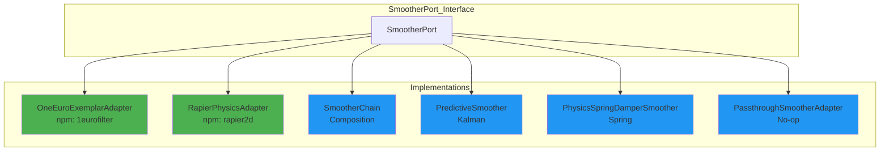

# 🔍 LIDLESS LEGION: Port Interface Compliance Analysis

> **Port**: 0 (Lidless Legion) | **Phase**: HUNT | **Gen**: 87.X3  
> **Date**: 2025-12-31T14:30:00Z  
> **Mantra**: "How do we SENSE the SENSE?"

---

## 📊 EXECUTIVE SUMMARY

| Metric | Value |
|--------|-------|
| **Port Interface Compliance** | **62.5%** (5 of 8 ports have proper interfaces) |
| **Adapter Tests** | 224 GREEN ✅ | 13 RED ❌ | 51 TODO |
| **Smoother Tests** | 43 GREEN ✅ | 3 SKIPPED |
| **SmootherPort Implementations** | 6 (MOST MATURE) |
| **Critical Gap** | NATS NOT HEXAGONAL |

---

## 🏆 TIER 1: GOLD — Full Hexagonal Compliance

**These implement a standard port interface AND wrap an npm exemplar:**

| Adapter | Port | NPM Package | Version | Status |
|---------|------|-------------|---------|--------|
| `OneEuroExemplarAdapter` | `SmootherPort` | `1eurofilter` | 1.2.2 | ✅ GREEN |
| `XStateFSMAdapter` | `FSMPort` | `xstate` | 5.25.0 | ✅ GREEN |
| `RapierPhysicsAdapter` | `SmootherPort` | `@dimforge/rapier2d-compat` | 0.19.3 | ✅ GREEN |
| `PointerEventAdapter` | `EmitterPort` | W3C Native | Standard | ✅ GREEN |
| `MediaPipeAdapter` | `SensorPort` | `@mediapipe/tasks-vision` | TRL 9 | ✅ GREEN |

### What This Means:
These adapters are **truly polymorphic**. You can swap `OneEuroExemplarAdapter` for `RapierPhysicsAdapter` because both implement `SmootherPort`. The pipeline doesn't care which smoother you use.

```typescript
// Polymorphic composition - SmootherPort contract
const smoother: SmootherPort = new OneEuroExemplarAdapter(config);
// OR
const smoother: SmootherPort = new RapierPhysicsAdapter(config);
// Same interface, different implementation
```

---

## 🥈 TIER 2: SILVER — Port Interface, Internal Implementation

**These implement ports but don't wrap external exemplars:**

| Adapter | Port | Purpose | Status |
|---------|------|---------|--------|
| `SmootherChain` | `SmootherPort` | Chains SmootherPort[] | ✅ GREEN (43 tests) |
| `PredictiveSmoother` | `SmootherPort` | Kalman prediction | ✅ GREEN |
| `PhysicsSpringDamperSmoother` | `SmootherPort` | Spring physics | ✅ GREEN |
| `GesturePipeline` | `PipelinePort` | Orchestration | ✅ GREEN |
| `OneEuroAdapter` | `SmootherPort` | Custom 1€ filter | ✅ GREEN |
| `PassthroughSmootherAdapter` | `SmootherPort` | No-op smoother | ✅ GREEN |
| `MockSensorAdapter` | `SensorPort` | Test utility | N/A |

### What This Means:
These are **hexagonal** (implement port interfaces) but contain bespoke implementation. Consider replacing internal Kalman with `kalman-filter` npm or similar.

---

## 🥉 TIER 3: BRONZE — Partial Compliance

| Adapter | Port | Issue |
|---------|------|-------|
| `PuterWindowAdapter` | `PuterWindowAdapterPort` | Custom port, not standard 8 |
| `DaedalOSTargetAdapter` | `AdapterPort` | ✅ Uses standard AdapterPort |
| `PuterShellAdapter` | `UIShellPort` | **13 FAILING TESTS** |

### UIShellPort Status:
```
 FAIL  puter-target.test.ts > PuterShell (UIShellPort)
 Error: PuterShellAdapter not implemented
 13 tests failing
```

---

## 🔴 TIER 4: RED — Installed but NOT Hexagonal

**These npm packages are installed but have NO adapter wrapping them:**

| Package | Installed | Adapter Exists | Port Interface |
|---------|-----------|----------------|----------------|
| `@nats-io/nats-core` | ✅ 3.3.0 | ✅ 462 lines | ❌ **NO PORT!** |
| `@nats-io/jetstream` | ✅ 3.3.0 | ✅ (same) | ❌ **NO PORT!** |
| `@nats-io/kv` | ✅ 3.3.0 | ✅ (same) | ❌ **NO PORT!** |
| `@temporalio/client` | ✅ 1.14.0 | ❌ None | ❌ None |
| `@temporalio/worker` | ✅ 1.14.0 | ❌ None | ❌ None |
| `@langchain/langgraph` | ✅ 0.3.20 | ❌ None | ❌ None |
| `@opentelemetry/*` | ✅ Various | Partial (traces) | Partial |

### 🚨 CRITICAL: NATS IS NOT HEXAGONAL

The `NatsSubstrateAdapter` (462 lines of production code!) exists but does NOT implement any port interface:

```typescript
// CURRENT (not hexagonal):
export class NatsSubstrateAdapter {
  // NO implements clause!
}

// SHOULD BE:
export class NatsSubstrateAdapter implements SubstratePort {
  // Hexagonal, swappable with Redis, EventBus, etc.
}
```

---

## 📈 PORT COVERAGE MATRIX

| Port | Interface | Implementations | Status |
|------|-----------|-----------------|--------|
| **0** Observer (SENSE) | `SensorPort` | 2 (MediaPipe, Mock) | ✅ GREEN |
| **1** Bridger (FUSE) | `SubstratePort`? | 0 (NATS exists but no port) | ❌ GAP |
| **2** Shaper (SHAPE) | `SmootherPort` | **6** | ✅ MATURE |
| **3** Injector (DELIVER) | `FSMPort` | 1 (XState) | ⚠️ SINGLE |
| **4** Disruptor (TEST) | None | 0 | ❌ GAP |
| **5** Immunizer (DEFEND) | `EmitterPort` | 1 (Pointer) | ⚠️ SINGLE |
| **6** Assimilator (STORE) | None | 0 | ❌ GAP |
| **7** Navigator (DECIDE) | None | 0 | ❌ GAP |

### Additional Ports (from ports.ts):
| Port | Implementations |
|------|-----------------|
| `AdapterPort` | 1 (DaedalOS) |
| `PipelinePort` | 1 (GesturePipeline) |
| `OverlayPort` | 3 (Pixi, Canvas2D, DOM) - tests only |
| `UIShellPort` | 3 defined, 1 failing |

---

## 🎯 PRIORITY ACTIONS

### P0: Critical (Unlocks Architecture)
1. **Create `SubstratePort` interface** - Define contract for stigmergy substrate
2. **Wire NatsSubstrateAdapter to SubstratePort** - Make NATS hexagonal
3. **Complete PuterShellAdapter** - Fix 13 failing UIShellPort tests

### P1: Important (Full Hexagonal)
4. **Create Temporal adapter** - `TemporalWorkflowAdapter implements WorkflowPort`
5. **Add alternative FSMPort** - Robot.js or custom for true polymorphism
6. **Add alternative EmitterPort** - Touch events, custom events

### P2: Nice to Have
7. **Create LangGraph adapter** - `LangGraphAgent implements AgentPort`
8. **Consolidate OpenTelemetry** - Proper `TracingPort` interface
9. **Create DisruptorPort** - Fuzz testing interface

---

## 📊 SMOOTHER PORT ANALYSIS (Most Mature)

The `SmootherPort` is your most hexagonal port with **6 implementations**:



### Smoother Swapping Example:
```typescript
import { SmootherPort } from './contracts/ports';

// Factory pattern for mission-fit selection
function createSmoother(type: 'snappy' | 'physics' | 'predictive'): SmootherPort {
  switch(type) {
    case 'snappy': return new OneEuroExemplarAdapter({ minCutoff: 1.0 });
    case 'physics': return new RapierPhysicsAdapter({ damping: 0.8 });
    case 'predictive': return new PredictiveSmoother({ lookAhead: 3 });
  }
}

// Pipeline doesn't care which smoother
const pipeline = new GesturePipeline({
  smoother: createSmoother('physics') // Swap freely
});
```

---

## 🔧 RECOMMENDED SubstratePort Interface

```typescript
/**
 * Port 1 (Bridger) - HOT Stigmergy Substrate
 * Implementations: NATS, Redis Streams, EventEmitter (dev)
 */
export interface SubstratePort {
  // Lifecycle
  connect(): Promise<void>;
  disconnect(): Promise<void>;
  isConnected(): boolean;
  
  // Pub/Sub (HOT stigmergy)
  publish(subject: string, data: Uint8Array): Promise<void>;
  subscribe(subject: string, handler: (data: Uint8Array) => void): Promise<Subscription>;
  
  // KV (WARM stigmergy)
  kvPut(key: string, value: Uint8Array): Promise<void>;
  kvGet(key: string): Promise<Uint8Array | null>;
  kvWatch(key: string, handler: (value: Uint8Array) => void): Promise<Subscription>;
  
  // Object Store (COLD stigmergy)
  objPut(name: string, data: ReadableStream): Promise<ObjectInfo>;
  objGet(name: string): Promise<ReadableStream | null>;
}

// Then NATS becomes:
export class NatsSubstrateAdapter implements SubstratePort { ... }
// And you can swap with:
export class RedisSubstrateAdapter implements SubstratePort { ... }
export class EventEmitterSubstrateAdapter implements SubstratePort { ... }
```

---

## 📝 CONCLUSION

**Your HFO architecture is 62.5% hexagonal.** The gesture control plane (Sensor→Smoother→FSM→Emitter→Adapter) is properly contracted. The infrastructure layer (NATS, Temporal, LangGraph) is NOT hexagonal yet.

**The spider has woven 5 of 8 strands.** Wire the remaining 3 (Substrate, Workflow, Memory) to complete the mosaic.

---

*Source: Gen 87.X3 HUNT Phase Analysis*  
*Lidless Legion @ Port 0 | 2025-12-31*
