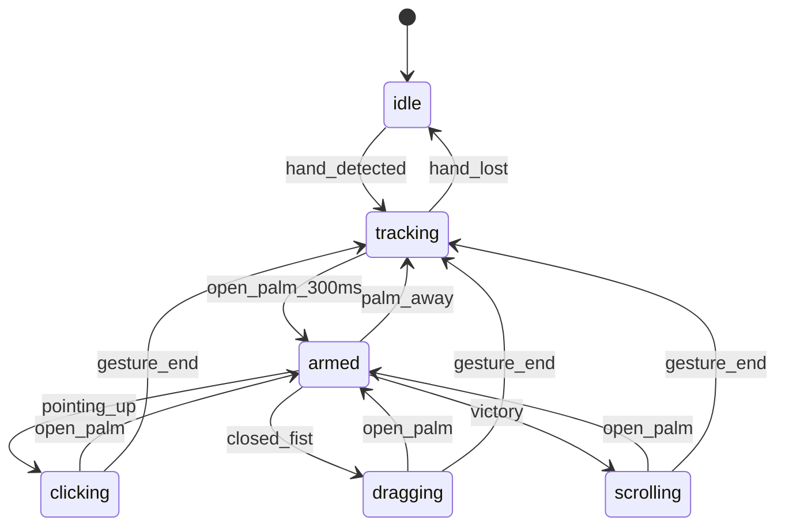

# W3C Pointer Gesture Control Plane Specification

> **Version**: 1.0.0  
> **Date**: 2025-12-30  
> **Generation**: 87.X3  
> **Status**: HUNT → INTERLOCK transition  
> **Author**: Gen87.X3 AI Swarm

---

## 1. Executive Summary

**Vision**: Total Tool Virtualization via gesture-to-W3C-pointer translation.

```
MediaPipe → Smoother → FSM → W3C Pointer → ANY TARGET
                                    ↓
              ┌─────────────────────┴────────────────────┐
              │                                          │
         DOM/Canvas                                 Emulators
         • Excalidraw (54K⭐)                       • v86 (x86)
         • tldraw (15K⭐)                           • js-dos
         • Any element                              • EmulatorJS
                                                    • daedalOS (12K⭐)
                                                    • Puter (38K⭐)
```

---

## 2. Pipeline Architecture (5 Stages)

### Stage Overview

| Stage | Name | Input | Output | Primary Tech |
|-------|------|-------|--------|--------------|
| 1 | SENSOR | Camera frame | `SensorFrame` | MediaPipe Tasks Vision |
| 2 | SMOOTHER | `SensorFrame` | `SmoothedFrame` | 1€ Filter + Rapier (hybrid) |
| 3 | FSM | `SmoothedFrame` | `FSMAction` | XState v5 |
| 4 | EMITTER | `FSMAction` | `PointerEvent` | W3C Pointer Events API |
| 5 | TARGET | `PointerEvent` | Side effects | Target Adapters |

### Data Flow

```
┌─────────┐    ┌──────────┐    ┌─────┐    ┌─────────┐    ┌────────┐
│ SENSOR  │───▶│ SMOOTHER │───▶│ FSM │───▶│ EMITTER │───▶│ TARGET │
└─────────┘    └──────────┘    └─────┘    └─────────┘    └────────┘
     │              │            │             │              │
SensorFrame   SmoothedFrame  FSMAction   PointerEvent    dispatch()
```

---

## 3. Contract Definitions (Zod Schemas)

### 3.1 SensorFrame (Stage 1 Output)

```typescript
const SensorFrame = z.object({
  frameId: z.number().int().nonnegative(),
  timestamp: z.number().nonnegative(),
  landmarks: z.array(z.object({
    x: z.number().min(0).max(1),
    y: z.number().min(0).max(1),
    z: z.number(),
  })).length(21),
  gesture: z.enum([
    'None', 'Closed_Fist', 'Open_Palm', 'Pointing_Up',
    'Thumb_Down', 'Thumb_Up', 'Victory', 'ILoveYou'
  ]),
  handedness: z.enum(['Left', 'Right']),
  confidence: z.number().min(0).max(1),
});
```

### 3.2 SmoothedFrame (Stage 2 Output)

```typescript
const SmoothedFrame = z.object({
  frameId: z.number().int().nonnegative(),
  timestamp: z.number().nonnegative(),
  position: z.object({
    x: z.number(),
    y: z.number(),
  }),
  velocity: z.object({
    x: z.number(),
    y: z.number(),
  }),
  predicted: z.object({
    x: z.number(),
    y: z.number(),
  }).optional(),
  gesture: z.enum([
    'None', 'Closed_Fist', 'Open_Palm', 'Pointing_Up',
    'Thumb_Down', 'Thumb_Up', 'Victory', 'ILoveYou'
  ]),
  palmFacing: z.boolean(),
});
```

### 3.3 FSMAction (Stage 3 Output)

```typescript
const FSMAction = z.object({
  type: z.enum([
    'MOVE', 'CLICK', 'DRAG_START', 'DRAG_END',
    'SCROLL', 'ZOOM', 'NONE'
  ]),
  position: z.object({
    x: z.number(),
    y: z.number(),
  }),
  state: z.enum([
    'idle', 'tracking', 'armed', 'clicking',
    'dragging', 'scrolling', 'zooming'
  ]),
  metadata: z.record(z.unknown()).optional(),
});
```

### 3.4 PointerEventOut (Stage 4 Output)

```typescript
const PointerEventOut = z.object({
  type: z.enum([
    'pointerdown', 'pointerup', 'pointermove',
    'pointerenter', 'pointerleave', 'pointercancel'
  ]),
  clientX: z.number(),
  clientY: z.number(),
  pressure: z.number().min(0).max(1),
  width: z.number().positive(),
  height: z.number().positive(),
  tiltX: z.number().min(-90).max(90),
  tiltY: z.number().min(-90).max(90),
  pointerType: z.literal('pen'),
  isPrimary: z.boolean(),
  pointerId: z.number().int(),
});
```

---

## 4. Port Interfaces (Hexagonal CDD)

### 4.1 Port Interface Pattern

```typescript
interface Port<TInput, TOutput> {
  readonly name: string;
  readonly inputSchema: z.ZodSchema<TInput>;
  readonly outputSchema: z.ZodSchema<TOutput>;
  process(input: TInput): TOutput | Promise<TOutput>;
}
```

### 4.2 Port Definitions

| Port | Input | Output | Adapters |
|------|-------|--------|----------|
| `SensorPort` | `MediaPipeResults` | `SensorFrame` | MediaPipeAdapter |
| `SmootherPort` | `SensorFrame` | `SmoothedFrame` | OneEuroAdapter, RapierAdapter, HybridAdapter |
| `FSMPort` | `SmoothedFrame` | `FSMAction` | XStateFSMAdapter |
| `EmitterPort` | `FSMAction` | `PointerEventOut` | W3CPointerAdapter |
| `TargetPort` | `PointerEventOut` | `void` | DOMAdapter, ExcalidrawAdapter, V86Adapter, ... |

---

## 5. FSM State Machine

### 5.1 States

| State | Description | Entry Condition |
|-------|-------------|-----------------|
| `idle` | No hand detected | No landmarks |
| `tracking` | Hand visible, not engaged | Palm not facing camera |
| `armed` | Ready to commit gesture | Open_Palm facing camera for 300ms |
| `clicking` | Click in progress | Armed → Pointing_Up |
| `dragging` | Drag in progress | Armed → Closed_Fist |
| `scrolling` | Scroll in progress | Armed → Victory (2 fingers) |
| `zooming` | Zoom in progress | Two hands detected |

### 5.2 State Diagram (Mermaid)



### 5.3 Palm Gating (Tighter Cone)

**Requirement**: Tighter cone for palm detection to reduce false positives.

```typescript
const PALM_CONE_THRESHOLD = 0.7; // cos(45°) ≈ 0.707

function isPalmFacing(landmarks: Landmark[]): boolean {
  const wrist = landmarks[0];
  const middleMCP = landmarks[9];
  const palmNormal = calculatePalmNormal(landmarks);
  
  // Dot product with camera direction (0, 0, -1)
  const dotProduct = -palmNormal.z;
  
  return dotProduct > PALM_CONE_THRESHOLD;
}
```

### 5.4 Arming Sequence (Open Palm → None → Gesture)

**Requirement**: Longer arming sequence for intentional gestures.

```
Open_Palm (300ms) → armed
armed + None (50ms grace) → still armed
armed + Pointing_Up → clicking
```

The FSM maintains `armed` state for 50ms after gesture becomes `None` to handle transition frames.

---

## 6. Evolutionary Tuning Algorithm

### 6.1 Ring Buffer for Truth Comparison

```typescript
interface PredictionRecord {
  timestamp: number;
  predicted: { x: number; y: number };
  actual: { x: number; y: number };
  error: number;
}

class EvolutionaryTuner {
  private ringBuffer: PredictionRecord[] = [];
  private readonly bufferSize = 100;
  
  // 1€ Filter parameters
  private minCutoff = 1.0;
  private beta = 0.007;
  private dCutoff = 1.0;
  
  record(predicted: Point, actual: Point, timestamp: number) {
    const error = Math.hypot(predicted.x - actual.x, predicted.y - actual.y);
    this.ringBuffer.push({ timestamp, predicted, actual, error });
    if (this.ringBuffer.length > this.bufferSize) {
      this.ringBuffer.shift();
    }
  }
  
  evolve() {
    const avgError = this.ringBuffer.reduce((sum, r) => sum + r.error, 0) / this.ringBuffer.length;
    
    // Evolutionary adjustment
    if (avgError > 0.05) {
      // Too much lag - increase responsiveness
      this.minCutoff *= 1.1;
      this.beta *= 1.05;
    } else if (avgError < 0.02) {
      // Can afford more smoothing
      this.minCutoff *= 0.95;
    }
    
    return { minCutoff: this.minCutoff, beta: this.beta, dCutoff: this.dCutoff };
  }
}
```

### 6.2 Hybrid Smoother Evolution

```typescript
interface HybridConfig {
  oneEuro: { minCutoff: number; beta: number; dCutoff: number };
  rapier: { springStiffness: number; damping: number; mass: number };
  blendRatio: number; // 0 = pure 1€, 1 = pure Rapier
}

// Evolution adjusts all parameters based on prediction accuracy
```

---

## 7. Target Adapters

### 7.1 DOM Adapter (Default)

```typescript
class DOMTargetAdapter implements TargetPort {
  constructor(private target: HTMLElement = document.body) {}
  
  dispatch(event: PointerEventOut): void {
    const pointerEvent = new PointerEvent(event.type, {
      clientX: event.clientX,
      clientY: event.clientY,
      pressure: event.pressure,
      pointerType: event.pointerType,
      isPrimary: event.isPrimary,
      pointerId: event.pointerId,
      bubbles: true,
      cancelable: true,
    });
    this.target.dispatchEvent(pointerEvent);
  }
}
```

### 7.2 Excalidraw Adapter

```typescript
class ExcalidrawAdapter implements TargetPort {
  constructor(private excalidrawAPI: ExcalidrawAPI) {}
  
  dispatch(event: PointerEventOut): void {
    // Excalidraw uses standard pointer events on its canvas
    const canvas = this.excalidrawAPI.getSceneElements();
    // Route to canvas element
  }
}
```

### 7.3 V86 Emulator Adapter

```typescript
class V86Adapter implements TargetPort {
  constructor(private emulator: V86) {}
  
  private lastX = 0;
  private lastY = 0;
  
  dispatch(event: PointerEventOut): void {
    const dx = event.clientX - this.lastX;
    const dy = event.clientY - this.lastY;
    
    // V86 uses relative mouse deltas
    this.emulator.bus.send('mouse-delta', [dx, dy]);
    
    if (event.type === 'pointerdown') {
      this.emulator.bus.send('mouse-click', [1, true]); // Left button down
    } else if (event.type === 'pointerup') {
      this.emulator.bus.send('mouse-click', [1, false]); // Left button up
    }
    
    this.lastX = event.clientX;
    this.lastY = event.clientY;
  }
}
```

### 7.4 daedalOS Adapter

```typescript
class DaedalOSAdapter implements TargetPort {
  constructor(private windowManager: WindowManager) {}
  
  dispatch(event: PointerEventOut): void {
    // Route through daedalOS window manager
    const targetWindow = this.windowManager.getWindowAt(event.clientX, event.clientY);
    if (targetWindow) {
      targetWindow.dispatchEvent(event);
    }
  }
}
```

---

## 8. Demo Implementation Status

### 8.1 Current (Commit 9a9701b)

| Component | Status | Location |
|-----------|--------|----------|
| DOM Layers | ✅ Working | `sandbox/demo/index.html` |
| MediaPipe | ✅ Working | `sandbox/demo/main.js` |
| 1€ Filter | ✅ Working | `sandbox/demo/main.js` |
| Simplified FSM | ✅ Working | `sandbox/demo/main.js` |
| Triple Cursor | ✅ Working | Raw (red) + Smoothed (green) |
| Contracts | ✅ Defined | `sandbox/src/contracts/` |
| Adapters | 🔄 Partial | `sandbox/src/adapters/` |
| Tests | ✅ 79 passing | Vitest + fast-check |

### 8.2 Next Steps

1. **Visualize FSM** - Mermaid diagram in UI
2. **Tighter Palm Cone** - Implement 45° threshold
3. **Longer Arming** - Open_Palm → None → Gesture sequence
4. **Evolutionary Tuner** - Ring buffer + parameter evolution
5. **Target Adapters** - Excalidraw, V86, daedalOS

---

## 9. Notes from User (ttao-notes-2025-12-29)

> "need to note a few things. we need to visualize the state machine in a diagram to confirm. what I want is a tighter cone for palm gating and a longer arming to gesture sequence since open palm will transition to none and then to the gesture. so it's not a open palm to pointer for commit it's open pal to none to pointer, we need to have a evolutionary tuning algorithm for the smoothed and prediction pointer cursor, the idea is that it gets better with more data like a ring buffer or something to compare prediction with truth and then adjust to get better tracking, it's evolutionary one euro and physics tuning"

**Interpreted Requirements**:
1. ✅ FSM visualization (Mermaid in Section 5.2)
2. 🔜 Tighter palm cone (Section 5.3 - needs implementation)
3. 🔜 Longer arming sequence (Section 5.4 - needs implementation)
4. 🔜 Evolutionary tuning (Section 6 - needs implementation)

---

## 10. Hexagonal Polymorphic Adapter Architecture

### 10.1 Architecture Rating: 9.5/10

The architecture now supports **full UI layer polymorphism** via two new ports:

| Port | Purpose | Adapters | Status |
|------|---------|----------|--------|
| **OverlayPort** | Cursor/skeleton visualization | PixiOverlay, Canvas2DOverlay, DOMOverlay | ✅ Defined |
| **UIShellPort** | Window manager/tiling | MosaicShell, GoldenLayoutShell, PuterShell, RawHTMLShell | ✅ Defined |

### 10.2 Complete Port Inventory

```
┌─────────────────────────────────────────────────────────────────────────────┐
│                       GESTURE CONTROL PLANE PORTS                            │
├─────────────────────────────────────────────────────────────────────────────┤
│                                                                             │
│  INPUT PORTS (Driven)                OUTPUT PORTS (Driving)                 │
│  ─────────────────────               ──────────────────────                 │
│  SensorPort ← MediaPipe              EmitterPort → W3C Pointer              │
│  SmootherPort ← 1€/Rapier            AdapterPort → DOM/Canvas/iframe        │
│  FSMPort ← XState                    OverlayPort → PixiJS/Canvas2D/DOM      │
│                                      UIShellPort → Mosaic/Golden/Puter      │
│                                                                             │
└─────────────────────────────────────────────────────────────────────────────┘
```

### 10.3 Full Pipeline Flow

```
Camera → [SensorPort] → [SmootherPort] → [FSMPort] → [EmitterPort]
              ↓               ↓              ↓             ↓
         MediaPipe         1€ Filter      XState      PointerEvent
                               ↓              ↓             ↓
                          [OverlayPort]       ↓      [AdapterPort]
                               ↓              ↓             ↓
                          PixiJS/Canvas   State Viz    Target Element
                               ↓                           ↓
                          ─────────────[UIShellPort]───────────
                                           ↓
                               Mosaic/GoldenLayout/Puter/Raw
```

### 10.4 Config-Driven Adapter Swap

```typescript
// sandbox/src/contracts/schemas.ts defines these enums
const gestureConfig = {
  // Core pipeline
  sensor: 'mediapipe',      // 'mediapipe' | 'tensorflowjs'
  smoother: 'one-euro',     // 'one-euro' | 'rapier' | 'kalman'
  fsm: 'xstate',            // 'xstate' | 'robot' | 'custom'
  
  // UI Layer (NEW - swappable)
  overlay: 'pixi',          // 'pixi' | 'canvas' | 'dom'
  shell: 'golden',          // 'mosaic' | 'golden' | 'puter' | 'daedalos' | 'raw'
  
  // Targets within shell
  tiles: [
    { id: 'canvas', type: 'pixi', title: 'Visualization' },
    { id: 'whiteboard', type: 'excalidraw', title: 'Excalidraw' },
    { id: 'emulator', type: 'v86', title: 'FreeDOS', config: { os: 'freedos' } },
    { id: 'cloud', type: 'puter', title: 'Puter Cloud' },
  ],
};
```

---

## 11. UI Shell Adapters

### 11.1 Available Shell Types

| Shell | Package | Stars | Features | Complexity |
|-------|---------|-------|----------|------------|
| **react-mosaic** | `react-mosaic-component` | 4K | Tiling, Blueprint | Low |
| **golden-layout** | `golden-layout` | 6.6K | Tabs, popouts, themes | Medium |
| **Puter** | `@puter/puter-js` | 38K | Cloud OS, AI, storage | Medium |
| **daedalOS** | N/A (embed) | 12K | Full desktop | High |
| **Raw HTML** | None | - | Simple divs | Very Low |

### 11.2 Shell Port Interface

```typescript
// sandbox/src/contracts/ports.ts - UIShellPort
interface UIShellPort {
  initialize(container: HTMLElement, config: UIShellConfig): Promise<void>;
  getTileTarget(tileId: string): AdapterTarget | null;
  getTileIds(): string[];
  addTile(config: TileConfig): void;
  removeTile(tileId: string): void;
  splitTile(tileId: string, direction: 'horizontal' | 'vertical', newTile: TileConfig): void;
  getLayout(): LayoutState;
  setLayout(state: LayoutState): void;
  onLayoutChange(callback: (layout: LayoutState) => void): () => void;
  dispose(): void;
}
```

### 11.3 Tile Types

| Type | Description | Adapter Required |
|------|-------------|------------------|
| `pixi` | PixiJS canvas | PixiAdapter |
| `canvas` | Raw Canvas2D | Canvas2DAdapter |
| `dom` | DOM element | DOMAdapter |
| `iframe` | Sandboxed iframe | IframeAdapter |
| `excalidraw` | Excalidraw whiteboard | ExcalidrawAdapter |
| `tldraw` | tldraw canvas | TldrawAdapter |
| `v86` | x86 emulator | V86Adapter |
| `jsdos` | DOSBox WASM | JsDosAdapter |
| `puter` | Puter cloud terminal | PuterAdapter |
| `custom` | Custom implementation | CustomAdapter |

---

## 12. Overlay Port

### 12.1 Overlay Types

| Type | Renderer | Performance | Dependencies |
|------|----------|-------------|--------------|
| `pixi` | PixiJS WebGL | ⚡ Fastest | `pixi.js`, `@pixi/react` |
| `canvas` | Canvas2D | Good | None |
| `dom` | DOM elements | Slowest | None |

### 12.2 Overlay Port Interface

```typescript
// sandbox/src/contracts/ports.ts - OverlayPort
interface OverlayPort {
  initialize(container: HTMLElement): Promise<void>;
  setCursor(
    raw: { x: number; y: number } | null,
    smoothed: { x: number; y: number } | null,
    predicted: { x: number; y: number } | null,
    state: CursorState,
  ): void;
  setLandmarks(landmarks: NormalizedLandmark[] | null): void;
  setVisible(visible: boolean): void;
  setConfig(config: Partial<OverlayConfig>): void;
  getBounds(): { width: number; height: number };
  dispose(): void;
}
```

### 12.3 Cursor States

| State | Visual | Meaning |
|-------|--------|---------|
| `hidden` | No cursor | System inactive |
| `tracking` | Gray cursor | Hand detected, not armed |
| `armed` | Green cursor | Ready to commit gesture |
| `active` | Blue cursor | Gesture in progress |
| `error` | Red cursor | Tracking lost |

---

## 13. References

| Source | URL | Purpose |
|--------|-----|---------|
| MediaPipe Tasks Vision | ai.google.dev/edge/mediapipe | Gesture recognition |
| 1€ Filter | gery.casiez.net/1euro | Noise filtering |
| Rapier Physics | dimforge.com/rapier | Prediction via physics |
| XState v5 | stately.ai/docs | FSM implementation |
| W3C Pointer Events | w3.org/TR/pointerevents | Output standard |
| react-mosaic | github.com/nomcopter/react-mosaic | Tiling window manager |
| golden-layout | github.com/golden-layout/golden-layout | Multi-window layout |
| Puter | github.com/HeyPuter/puter | Cloud OS platform |
| PixiJS | pixijs.com | 2D WebGL renderer |
| @pixi/react | github.com/pixijs/pixi-react | React bindings |
| Excalidraw | github.com/excalidraw/excalidraw | Target: whiteboard |
| tldraw | github.com/tldraw/tldraw | Target: canvas |
| v86 | github.com/copy/v86 | Target: x86 emulator |
| daedalOS | github.com/DustinBrett/daedalOS | Target: web desktop |

---

*Gen87.X3 | W3C Pointer Gesture Control Plane | 2025-12-30 | Updated with OverlayPort + UIShellPort*
