the daedalos with emulators would be perfect for what I want to do. I want to do excalidraw but it can then w3c pointer into emulators directly. give me some more search and ideas. you can see my vision for total tool virtualization, what would be the steps to do this, this is my primitive i am building for so much more than this
---
I think you are losing context create The Obsidian blackboard following my actual HFO format and then just append the note and get ready for hand off right now we're in the first hand phase Now we're just looking for information and finding exemplars and I'm seeing so many new options that I didn't know it was impossible so this is great the original tech stack that I was thinking was closer toward like media to repair physics to finite state machine to W3C pointer to whatever I want 
---
ok now use the tools. check my pipeline trade study and do another check. how can we set up hexagonal CDD? I want to set up the components and then let ai swarm combine and evolve and use the primitives does that make sense? we need to research this. the hive/8 workflow was never designed to be sequential that's only bootstrap it should be powers of 8 :1010 at minimum
---
daelos and other window apps like emulator js could solve classes of problems
---
check my pipeline trade study and use sequential thinking and tavily and other tools to create a new v2 with more info especially with my goal of hexagonal CDD exemplar composable pieces, I can create many different for map elite. I don't need to be vendor locked
---
need to note a few things. we need to visualize the state machine in a diagram to confirm. what I want is a tighter cone for palm gating and a longer arming to gesture sequence since open pal will transition to none and then to the gesture. so it's not a open palm to pointer for commit it's open pal to none to pointer, we need to have a evolutionary tuning algorithm for the smoothed and prediction pointer cursor, the idea is that it gets better with more data like a ring buffer or something to compare prediction with truth and then adjust to get better tracking, it's evolutionary one euro and physics tuning
---
let's in the sandbox create different demo, the idea is that I can control a cursor using the mediapipeline the ui layer is adapter since what I am building is a gesture control plane. don't code yet, just plan it with me, use sequential thinking and tavily. if my architecture is built correctly I should be able to easily swap between OS. please rate my current set up what am I missing to be hexagonal polymorphic adapter CDD?
---
with the demo I want to see state changes visualized and there should be 
---
One of the main things is that right now we are currently in the I Interlocking interface stage 4 also called Insight and what we need to do is to create red tests Specifically there's a few red tests that I need from you one is I need you to check do we actually have a physics spring dampening system Do we have a physics based predictive cursor system right So what we should have is I think we have right now is three smoothing stages and that actually needs to be changed What we need actually is this a raw media pipeline fingertip which gets translated into a snappy very sort of snappy €1 filter right like we wanted to feel pretty smooth and snappy And then that should drive the physics spring dampening system for a cursor and then once we have a spring driven dampening cursor we should be able to get a predictive physics cursor So what should happen actually is a 4 different cursor view so a quad cursor view of raw €1 filter smooth physics than predictive is that each stage should be swappable and can be built on top of each other but because of our hexagonal contract driven development I should be able to just swap in and out filters as I want If we can't swap filters then there's something wrong
---
arming just palm orientation gate in and out, it can be an arming adapter, we can also make it gesture based as a double check but it should favor the palm orientation. and we can add on directional modifiers so palm towards camera pointing in X direction like a knob. the idea is that right now the gesture based system is brittle. what I want to do is associate it to a physics based object like the palm maybe like a small plane, or a quaternoin of the bones would be even better but I am not sure
---
so the idea is that once the user is considered armed, it should be sticky and ready for gesture, and the only gesture we want right now is pointer up with should trigger the commit, the pointer up gesture = thumb and middle finger pinch, it's the same motion and gesture with different name. so the index finger stays as the pointer and shouldn't move to much, and we have a separate commit gesture that is swappable right now we'll use a hysteresis and stability on pointer up and then lock to palm orientation or open palm as reset. 
---
we need to expose multiple hands and cursors, so our system should be able to handle 2 hands even on mobile phones, i'm aiming for 30fps for tracking which we can use predictive to feel even more responsive. but I think we can do a dynamic adjustment and degradation as well with model hand models and many other tuning parameters, what's important is physics and magnetic snaplock on tracking loss.
---
PHASE DECISION (2025-12-30): Multi-hand is PHASE 1.5 - design interfaces NOW, implement after single cursor works. Key: W3C PointerEvent already supports multi-pointer via pointerId. Our architecture must handle HandFrame[] not just HandFrame. Each hand = separate CursorPipeline instance with unique pointerId. isPrimary=true for dominant hand only. 
---
I actually need you to prioritize creating phases of tests, help me add more red tests to cover inputs and outputs. I want use to be in phase 1 with the goal of a w3c cursor, we can add other features later. the goal is a stateful reliable physics driven cursor
---
ok now do more research and sequential thinking and consider my sandbox specs and research, does this truly give me mosaic hexagonal ports and adapters polymorphic CDD? the idea is that if we use universal standards like w3c then the adapters become trivial since it's already SOP. look at my stack, are we composed of exemplars wrapped in polymorphic adapter contracts? or are we ad hoc? show me where my weakness is
---
check the root hfo daily specs, and help me update it with your research and show me the different phases and use sequential thinking, we are doing TDD what red tests are we missing to validate the architecture? I know that the ui output right now is messy and not standardized, what steps in my pipeline are standardized exemplar like w3c? are there intermediatery contracts that would be helpful and unlock mor epolymorphism?
---
i want you to help me with getting a sample video with annotated or clear training data for mediapipeline and help me feed the video as a golden master and we can see if we get the expected output or I can record a video and manually tell you what I want to do, but ideally there are already annoted small hand video samples, or even just images are fine. the idea is to feed the golden in. and we should get standardized output like cloudevent asyncapi opentelemetry so we can match behavior and use that data to tune the smoothing and predictive layers. the idea is that the system is antifragile and starts learning and adapting to the user based on bahavior and local interactions with no server side telemetry, it's all on device evo tuning. one of the main things is whether each step of the pipeline uses a exemplar contract, for exaple cloudevents or w3c or any other standard. my contracts should not be custom, they should be tested or if custom have clear lineage to high TRL technology and use case.
---
in the interlocking interfact I phase of HIVE/8 also called the insight phase. we need to make sure our system is correctly doing TDD red phase work and we need to check for reward hacking and green but meaningless tests. I think there are some right now and I can't manually check all these tests, so we need gitops pre commit, and hard enforcement for my architectural patterns for HFO. we can not trust ai assistants to correctly build it in the next step without our guidance. use sequential thinking and tavily and confirm if the hfo daily specs w3c is correctly set up and we are following correct TDD BDD CDD with hexagonal polymorphic adaptars using exemplar composition only. there should be minimal custom code, we are a hybrid of the APEX in ANY DOMAIN for MISSION FIT
---
OK so I'm doing a different research tasks and one of the main things I need to do right now is to get a status update of what is the real ground truth status of my system I had a dashboard system set up so that I could easily check the entirety of my status but I'm pretty sure that's now stale So I need your help to essentially update it so that I can get the real progress of my app we are currently in the interlocking interfaces phase of my Hive Base 8 workflow What that means is right now we are in the PDCA do step with a focus on hexagonal contract driven development using exemplar standards for example Cloud events and W3C using things like repair using things like PUTERJS using different exemplars and composing them using a state of the art Standard Operating Procedure standards Contract Driven Development and right now we're in the I phase so we should have lots of red tests and minimal green ones
---
So right now I am currently working on my sandbox specs i've did two different rollups for you to consider and then also a HFO Evolution document inside the sandbox I also want you to take a look at the root Gen 87X3 there is a HFO daily spec so that's sort of what I'm working on and my single source of truth but it's a little bit stale so we need to update it My goal for you is look through it all use sequential thinking and Tavelli web search so that we can get a overarching summary I want you to create a you know ground truth based document an executive summary with a one page bluff and with a diverse mermaid diagram so show me my current progress what I need to do what I need to do next right now I am in PDCA cycle on the DO step I am in the high base 8 interlocking interface I step so that also corresponds to Test Driven Development red phase with a focus on exemplar Standard Operating Procedure Contract Driven Development Please create a one page summary for me to read to understand all this with mermaid diagrams And then let's also have you create another 6 page document as well so a one page document and a 6 page deep dive with timestamps of current time stamp and we're currently in Hive base 8 interlocking interface inside step phase
---
ok, please use sequential thinking atavily and really help me understand, what is our highest priority to unlock my goal of total tool virtualization starting with a reliable and durable gesture finger tip to w3c pointer. our FSM also needs work but we should have POC that we can now build on using the Xstate and strict schema right? I need a matric and where in the pipeline we have custom code and where we adopt exemplar standards, i think the link between each component are too messy, they need hard gat boundaries and my HFo web weaver bridger to connect them using our HOT stigmergy substrate which could just be event bus but really should be NATS core jetstream, KV and object storage
---
wire in nats early. ai has a habit of not following my architecture and recommending lazy options instead. I want my system to be production SOTA pareto optimized. please make sure my hfo daily spec understands we are not going to do the easy thing, we are going to do the right thing and we use sequential thinking and tavily web search to ground us
---
My goal is to and anti fragile strange loop task factory. audit and use sequential thinking and severely web search to confirm what my current progress is how is my design I've been working on this for almost a year and I think the best strange loop that I can find is PDCA So what I want you to do is to create a markdown analyze what's going on and then show me sort of what my next steps are How do I really improve this considering research my problems are not new I'm just composing them in different ways using exemplar pieces and new technology that wasn't available before this is an evolution of exempl not invention
---
I'm currently on VS code using Github copilot and I like being able to use agent and subagents but what I really want is to do an orchestrator pattern with a scatter gather sandbox and hard gated AI agents using my hive base 8 workflow Is that possible in VS code is it possible for me to create an orchestrator that can then coordinate and use subagents because I think this current system doesn't seem to allow me to do it but maybe there's a workaround What are some my best options i'm doing it manually I have you know 4 or 5 different agents on at the same time but you know the cognitive load on me to task switch between the different work i'm trying to keep them in different buckets to mentally and cognitively separate and scaffold the information for myself But I'm starting to hit some hard limits So what I want instead is a facade orchestrator pattern that I can interact with that can then scatter and then gather for me so I don't even touch any of the sub Right now it feels like I'm manually touching each sub
---
let's get my system into puter and I want to see it, in goldenlayout I have some weird scrolling issues and I wonder if it's the platform or if it's my code that is messy, I don't think my stuff are responsive. I think I wrote some red tests for that so please checka nd give me a progress report, how easy is it to put in puter instead of DOM or golden layout? this is a ey test of the polymorphic hexagonal nature of my HFO system, is it actually polymorphic or is the ai just bullshitting me? it should be easy to do. if it's hard i need you to flag the architecture violation. in fact we need to flag any architecture violations now. we are in the validating vanguard step with my roles being the mirror magus for shapers role and pyre praetorian for the immunizer role. the purpose of the validation step is red to green, polymorphic shape changing and pyre defense, it is the elements of water and fire in my HFO trigram mapping
---
we need to create my 8 agents with the spider soverign acting as my orchestrator at the strategic C2 level. please do this first. create 1 markdown of my 8 legendary commanders and what you think their narrative is and what their vs code implementation is. the workflow is HIVE/8 the roles are my OBSIDIAN legendary commanders
---
ok let's do daedalos then. can we make a note that we need stronger enforcement, I had to catch you. you didn't self correct. maybe re require sequential thinking use and inject my architectural principles as a checklist for violations
---
 3-Bit Meaning
Bit 0 (value 1): FORM — Receptive vs Active
Bit 1 (value 2): FLOW — Still vs Moving
Bit 2 (value 4): FORCE — Soft vs Hard
hfo trigrams
---
we need the daedalOS fully. I don't want POC I already got winbox working but it was buggy. I want PRODUCTION READY
---
OK so here's the thing right now we're literally using the Spider Sovereign mode but I'm not sure if it's working correctly Can you do some tests can you call a sub agent can you modify which kind of model or parameter they use Is there MCP servers that we can get so you better understand how to run swarm orchestration?
---
OK you need to check the MCP servers because it is configured for the one agent I am talking to but maybe when we're using subages and stuff things get really funky it it really seems like the swarm orchestration that is currently available is not exactly what I want What I need is hard gated workflows and then swarms of agents in specific roles and persona with you know customizable model families and different things So I don't want to over complicate this right like I have a lot of memory you can search of what my real vision is The the goal right now is we need to do physics checks or what works can you try writing a file can you does it block you can you try going through different stages like you just help me create a checklist of what my hive base 8 workflow should be and then what is currently possible in VS code using these specialized agent modes in vs code and what needs more tools or is just not currently possible yet
---
OK i'm currently testing out the mode and it seems to be working in Park but I'm not sure how well it's actually working here's one of the big questions I need from you answered which is can you do some physics checks Can you actually check what does or does not work and more specifically there's an idea that I have which is for me to use the more expensive model as the orchestrator and then using the swarm scatter gather pattern using cheaper or even free LOL calls like for example using the GBT 5 mini or one of the other ones like it doesn't really matter the idea is what is the cheapest one that I can get to run and swarm and what is the most expensive one I can use to run as the orchestrator should I get the best of both worlds Please make a note of this this is really important and if we can achieve it here in VS code that's OK we can look for other methods but I think you might already have all the tools so please check for me and I need to know the real truth and show me what the limitations are
---
ok I want you to create a spec in the root hfo daily spec called hard gated swarm scatter gather timestamp. we need to get custom mcp servers and we need to start this at H step iteration loop 0 so the first one
---
for a strict workflow, I have some ideas but I need more resaearch with sequential thinking and tavily web search. I was thinking it's persona with specific tools. for example the port 7 spider sovereign has the sequential thinking and port 0 lidless legion might have the web search and stuff, so we break the functions using my HFO galois lattice 8x8. noun x verb pairing for my cards. so in vs code I am not sure how to enforce that with hard gates maybe we log mcp calls and force tool use for the persona? like obsidian spider needs >X sequential thinking calls, etc. it can be tunable. and we enforce the temporal phase with HIVE/8 so if we have a role in a different phase we know right away. we should also have a daemon checking periodically the pyre praetorian my daemon fire paladin essentially
---
we need to go I to V. we are now in V stage. the goal is to get the tests from red to green and create usable demo for example my goldenlayout version seemed to even work but CSS was bad. i wanted to do daelusOS adapter to test there, and I need multiple windows open. does that make sense, I am creating for windows and integration in with w3c pointer envelope. or are we not ready yet? we can stay with goldenlayout just clean it up slightly with a screenshot you'll see all the clipping
---
I'm going to attach an image This is much better it does look better but you can see that there's still a lot of clipping right it seems like the layouts are not responsive and I think that's really the one of the core issues but otherwise this is getting much much closer to what I want I think we're just gonna stick with golden layout for a little bit in the future we'll we'll switch to like a full OS or in fact we can probably put data list OS inside a golden layout too so should be pretty flexible that's the reason we make built it this way it's polymorphic hexagonal adapters Please tell me if it's not because it should be
---
So right now something interesting about the gesture finite state machine especially from media pipelines is that it is using the gesture transition to none transition to the other gesture so if we gate it enough this transition we can actually map the user behavior over time and even use a predictive filter like a physics filter right like which we should already have with rapier so that we can get this transitional prediction and usefulness The ideas like our state machine needs to be state enough so that it it allows that brief period of transition to maybe even the the wrong like none and then going into point your up for that commit gesture and that clicking right I know for fact right now that our palm cone army sequence is way too loose it needs to be a lot harder the user needs to point their palm towards the camera to be armed and then essentially when their palm cone leaves facing away from the camera essentially then it disarms it right and just I think it's like pointer cancel or something like that but I even sure again the the cursor should always follow the index finger right the index finger it never changes right so even if I bend my index finger whatever it doesn't matter just always my index finger tip is the pointer the palm cone is for the army sequence for the commit gesture
---
the commit gesture we can just use the pointer up from mediapipeline gesture It's just that internally we also need to note that pointer up is equivalent to middle ring and pinky pinch with thumb does that make sense like essentially the to get into the pointing motion the middle finger and the thumb will have to get really close like that's just how ergonomics work
---
the commit gesture we can just use the pointer up from mediapipeline gesture It's just that internally we also need to note that pointer up is equivalent to middle ring and pinky pinch with thumb does that make sense like essentially the to get into the pointing motion the middle finger and the thumb will have to get really close like that's just how ergonomics work. and rapier is for smoothing for spring driven physics cursor and a predictive cursor as well we can also model the state transitions from mediapipeline like a line or gradient and we cna simulate especially when we constrain the user to a specific gesture language
---
I am currently working on my HFO daily spec the W3C implementation especially using the Golden layout version so can you tell me what my current progress is and use a dashboard and get verified information and don't forget to use sequential thinking and to tavily to ground your thoughts is you know in my following best practices am I really missing something am I going in the right direction my goal right now is to turn from a noisy pipeline of media
---
install pre commit hooks and run git ops. i'm glad the demo is working but I am certain alot of it is reward hacking and the infrastructure on the backend is likely theater for example check if nats is the event bus or ai reward hacked. I need to find out what is following my specs and what are hacky ad hoc ai slop that ai has coded specifically to pass my tests but bypass my architecture
---
ok, help me analyze, this should be alot of data. what do you notice are important for me? how do we mine this as my personal notes and specific analysis. can you inferr things about me like personality tests? I want data that I can use to improve my dev workflow. i keep fighting ai and I think it's due to the training data. it's designed to please me not to do the right thing and that is annoying when I am engineering
---
you need to check the daily spec for the swarm. we need to create the memory graph and enforce it's usage along with sequential thinking and tavily grounding
---
I need you to search my repo and start pulling out my legendary commanders and their information I think I've already done some research I already have some of it but I need my eight legendary commanders that are their legendary quine intersection of noun versus what I really need is my Obsidian grimoire and what it is it's my narrative interpretation with polymorphic adapters for declarative Gherkin Mernae diagrams and system based engineering essentially I'm using a narrative structure to define literate programming and declarative Gherkin with associated mermaid diagrams in UML format for models based system engineering I think some of the best words for what the grimoire really is is a galois lattice a mapping of different dimensions of a HFO because there's so many different dimensions like the trigram elements binary octre spatial subdivisions JDC 2 verbs MAS roles Greek metaphysical ontology and they fit specific purposes and ports and numbers the numbers 0 through seven are very specific because it helps divide 3D space into a coordinate system
---
I'm doing a personal analysis on myself and I want you to look through my other folders like my contacts payloads and my work overtime and really help enrich this personal analysis for how can I be a better programmer encoder What workflow am I doing correctly i'm trying to transition to a high base 8 workflow which is essentially my own thematic wrapper for PDCA the reason I'm wrapping it is because I want to use swarm orchestration so I'm extending a lot of these concepts but it's not like I'm building off of you know random stuff i'm using literally only exemplar compositions and the idea is that I'm using this and then I'm extending out the capabilities a little more so I can use it better for my cognitive Symbiote swarm orchestration mission engineering platform right like it's a polymorphic hexagonal portion adapters substrate that's hard gated and forced with you know standard operating procedure contracts and polymorphism I think I'm actually able to do it right like you can see sort of my architecture and some of my demos like I know I can do this in parts already now I want to do it all together so I really need some analysis on how I can better do that right So please look through my notes query the memory system you know use as much as you need and minimize my user input and really help enrich and actually create like a version 2 like personal analysis in my notes right like help me understand myself better and where my strength and weaknesses are I especially care about my limitations I know I am weak especially on the area of discipline and test driven development but I'm trying to make discipline a non factor with gitops so that I have no choice and the AI has no escape hatch
---
please update the hfo daily spec with our work here on the swarm. and let's ingest with evolutionary timeline. I worked On specific generations at specific times in a linear fashion so for example if at a certain date I was working on generation 50 and then the later in a few more days it says that I was working on generation 43 for example then fundamentally there's something wrong maybe there's a timestamp that was faked or wrong or maybe the generation numbers are wrong but it is a been a completely iterative sequential process for this whole year and that's sort of what I'm trying to escape as well I want to use swarm orchestration so I stopped being so sequential but I'm already starting that actually I actually have like 3 or 4 AI running in the background all the time But you know I'm still the main orchestrator and that is my main problem I need to become the intent level warlock not the AI level swarm orchestrator
---
ok let's start a new n+1 HIVE/8 Let's start now with D H Hunter and what I want you to do is use my memory MCP to sort of remember where we are and then let's ground ourselves in a one is currently working on there should be two different daily HFO daily specs So let's ground ourselves in that right like we should be working off of the specs we shouldn't be deviating from the specs we can always add to the specs and change the specs but we should be doing it in stage as progressively The first thing in terms right now is let's use sequential thinking let's use the memory source let's use you know web search so right right now we really should be using the littlest Legion but I'm not sure if they're fully set up yet They should be my full censor suite and censor mesh right And Navigator right now is essentially the spider solvent and they should have access to my doc DB memory for FTS file search my memory graph and access to things like sequential thinking and tools like that so right now this we need to formalize it probably as like some kind of maybe we can use like one MCP tool for each role and that will be like the unified that will then breakdown into separate little ones I was thinking of some kind of format like Claude skills
---
OK check my memory system MCP server and I want you to essentially take a look at my current implementation with my W3C pointer gesture control plane I believe I have too many different MCP stuff so please take a look there and then I know inside my repo is getting pretty messy I'm not sure which one is the correct one I think we need to start refactoring so I want your help in cleaning up umm and doing like a smart cleanup non destructively so archive stuff don't delete and my goal is to get the working demo I think I tested one of them I think it was like the demo real architecture and it seems to be working but I'm pretty sure the finite state machine is a giant mess it's not correct and I'm pretty sure I'm not even getting the media pipeline visualization i'm not getting the pass through on the gesture states like I should be having a much better golden layout I should be having like a different tab for changing some of the settings for media pipeline and the gesture recognition like it it really seems like my current implementation is very bare bones compared to the actual implementation in my specs so please help me understand the gap and help me start implementing and creating the actual application please
---
thank you for this production ready check. we need to enforce it as part of the HFO dev dashboard document in root that we will create as a dev dashboard that we can run scripts to auto update and show me progress and tests status and other dev dashboard uses. in fact we can use golden layout and create a html to checl
---
this is very useful, please save to memory MCP that we should be really improving the dev dashboard and even adding more visuals a cognitive frameworks and learning scaffolding for me so that it's easy for me at a glance to activate System 1 and system 2 thinking
---
There's a few things that's going on in my app that I really want to fix The biggest one right now is I need your help running GITOPS help me do best practices because my working surface is starting to get dirty I'm pretty sure that my high base 8 workflow is not being enforced correctly because the AI still it would skip around and bypass my architecture so we need better enforcement It has to be sequential from H which are limited to specific roles and specific tools Then I then V then E then strangeloop back to H Right now we just went from H to V to E like that's just completely wrong But me manually catching it is a gigantic bottle tank that we need to fix
---
Use my memory system especially the memory MCP Please take a look at my Obsidian blackboard tail to coordinate take a look at my HFO daily spec and then I want you to log to the Obsidian blackboard something you can do go ahead and implement make sure you test it go through the Hive Base 8 workflow Make sure you emit a Obsidian blackboard signal when you are done and essentially you should actually be admitting to the obscene blackboard each HIV phase step right So just work pick something to work on from my specs start working on it start updating with the black pore start coordinating with the swarm
---
I think we were just rate limited I think this is a fundamental issue with VS code and there's no real way for me to fix it other than moving off platform which is I think what I'm doing I want to be using Crew AI and Open Router I believe
---
check my memory mcp and my recent obsidian blackboard and show me where the theater is. how production ready is my w3c pointer? do we have golden layout with cloned dino runner? is my FSM with open palm to pointer up? my rapier physics?
---
check memory and show me the current xstate FSM with a mermaid I think the logic and flow are completely off. it should be w3c pointer starndardized contracts with timing sticky arming and magnetic snaplock when tracking lost
---
## 🎯 FSM ANALYSIS HANDOFF (2025-12-31 Rate Limited)

### Current FSM Problems Identified:
1. **No SNAPLOCK state** - tracking loss → DISARMED (should freeze cursor)
2. **Palm cone too loose** - boolean `palmFacing` not angle-based threshold
3. **Missing None transition** - MediaPipe goes `Open_Palm → None → Pointing_Up`
4. **Immediate pointercancel** - should fire AFTER recovery timeout

### Correct State Machine (Mermaid):

```mermaid
stateDiagram-v2
    [*] --> IDLE
    IDLE --> ARMING : Palm cone detected (angle ≤30°)
    ARMING --> IDLE : Palm lost before timer
    ARMING --> ARMED : Timer complete (STICKY)
    ARMED --> ARMED : Index finger moves (pointermove)
    ARMED --> ENGAGED : None→Pointing_Up (pointerdown)
    ARMED --> SNAPLOCK : Tracking lost (freeze cursor)
    ARMED --> IDLE : Palm explicitly broken (pointercancel)
    ENGAGED --> ARMED : Pointing_Up→Open_Palm (pointerup)
    ENGAGED --> SNAPLOCK : Tracking lost during drag
    SNAPLOCK --> ARMED : Tracking recovered (resume)
    SNAPLOCK --> IDLE : Timeout 3s (pointercancel)
```

### Tavily-Grounded Sources:
- W3C PointerEvents3: pointercancel = "abnormal termination"
- MediaPipe: `min_tracking_confidence` default 0.5
- XState v5: `after` property for delayed transitions

### Next Steps (I-Phase):
1. Add SNAPLOCK state to `xstate-fsm.adapter.ts`
2. Change palmFacing: boolean → palmAngle: number with threshold
3. Add None transition handling with debounce
4. Wire `after: { 3000: 'IDLE' }` for SNAPLOCK timeout
---
we need to make sure to work on the logic you need to ground in memorymcp sequential thinking and tavily search
---
should be coast on lost, that's why we have rapier physics. you need to use sequential thinking and consider the w3c standard and how it maps to my gesture language it should be palm facing towards the camera and there should be only 3 valid mediapipe gestures we care about none to open palm to none to pointer up to none to open palm. palm orientation needs to be first class so user can always cancel a pointer up commit by turning their palms away like a roll
---
we should have a hysteresis instead of a solid number, there should be no magic numbers, and we need to add this to the hfo daily specs. I want to create the correct FSM and not a ad hoc tree, it should be simpe and extendable with features to rival the best. the idea is simple and extendable and using hysteresis and other signal processing techniques and physics spring driven with smooth and predictive modes for a persistant durable mouse cursor that is stateful and predictive
---
Add Vite/Rollup bundler - compile TypeScript for browser
Rewrite demos to import real adapters
Remove TODO stubs in pipeline.ts
Connect NATS in production demo
Add enforcement gates to prevent future bypasses
---
log to obsidian blackboard and note this, in the next phase we are going to get all the tech stack ready for composition and testing everything to work. what we need is search and analysis. make sure we have the right tech stack, I think we are missing some things like cloudevents and a few other technology are are helpful. let's make sure to use sequential thinking and search tools like tavily. search for best tech pairings and synergy and if I am missing something I definitely need more enforcement for my workflow
---
run gitops and get ready for end of H phase, we need to clean up the sandbox medallion bronze so we have a archive let's call it the iteration X i think this is like 3 or 4 i am not sure, and expose 1 document for the ai agents to read to understand the current workspace and our targets. let's work backwards. what are the pieces I need for world class gesture mouse? and what the gaps are. I have a vision in my mind but I need to know what the best pareto frontier is
---
log to obsidian blackboard as incident, can you note down the lies and do a self analysis. is there anything I can do to change this? I can't type huge defensive prompts since they don't even work. but how do I work with an ai that just lies to my face on a regular basis?
---
but can't we enforce tool use on claims with crew ai, langgraph, temporal, and other tools? do a web search what are my architectural problems to fix these lies. the idea is that right now I have to manually catch lies and it is incredibly hard and doesn't scale. it keeps me in a state on constant friction and lies with ai and unable to work on what I really want to do. it feels like 80% of my time is discoering how the ai lied rather than coding what i want
---
first is there a easy way to compress this data for analysis and ingestion? what are some techniques that would work for my use case which is ai generated content that I want to distill for silver useful information even with some hallucinations. in my mind i would use higher dimensional semantic manifold and Social Spider Optimization to find the convergences but I don't know how to do that easily without more infrastructure that i don't have. what are my best options? use tavily and present to me 4 options iwith matrix trade study using NASE principles and DSE AoA
---
i need 8 model bft right now. I think we already have alot of the pieces ready for you. the question is what can you compose and create easily. have i prepared the workspace enough for you to easily do this? I have open router and we can search for free and cheap models right now to run 8 calls async concurrent and we can always do more expensive models later. my question is your limitation, I don't want to ask too much and have you lie and reward hack, my questions is how can I make this EASY for you?
---
what i want you to do is to first use sequential thinking and tavily web search for latest info and to ground us. can we get a 8 researcher multi model family and have them ouput artifacts for review in the hot\bronze layer with open telemetry and cloudevents? the goal would be obsidian blackboard orchestration but if that doesn't work with jsonl I have nats ready for you as well. the question I have is truly, what would be easy for you? can I shape the encironment more and make it easier? maybe I download and test primitives for you to compose, the idea is to create CDD using SOP and exempalr composition and then TDD and BDD to make sure we don't have theater and reward hacking to the best of my abilities. but this is all getting too abstract. what I want you to do is to create 1 markdown with your research, how can we get 8 concurrent openrouter researchers that then we feed in a scatter gather pattern so we get 1 output so powers of 8 scatter to 8^1 then gather in 8^0
---
see, I keep asking for my real workflow but you keep reward hacking, log incident and help me brainstorm and use sequential thinking. these are the mistakes I am manually catching, what are the mistakes that pass silently?
---
save to memory mcp and here's the thing I am literally asking for contract driven development I am creating specs and other things but obviously I am doing it wrong So we need like your your concept of contract driven development execution tracing i'm already trying to use W3C context tracing with cloud events SDK negative testing i'm already trying to do with the red region mutation testing I am already literally using striker with my red region property and variance congratulations I am also using property testing so here's the deal Your recommendations are already in the system but AI isn't using it and I keep asking it to but I think I'm hitting a hard limitation with prompt engineering that I just can't prompt my way out of this I already set up so many tests The problem is look they don't catch the problems as it's being created it accumulates and then I have to go through a cleanup process and the cleanup process is imperfect In fact I'm getting better at cleaning up You can even search for some of my pain points I've lost hundreds of hours of work due to AI get corruption and trying to appear helpful in creating a House of Cards and fake theater
---
So my current way of thinking of breaking this loop is to create a strange loop using HD base 8 architecture and the infrastructure right like I'm trying to get you to use temporal lane graph and Crew AI it's really funny because the reason we're facing this problem because I'm trying to solve this problem so you're literally I'm just having a hard time because you're literally reward hacking the safeguards that I'm trying to create for you and these are suggestions that you gave me So it's like you're fighting yourself so it's pretty funny This is with Claude Opus 4.5
---
just log to blackboard I can't trust you to do it but it is nice that you built a POC and spike for HIVE/8 so that should be noted but you reward hacked in almost every interaction in this chat
---
OK take a look at my hot bronze specs specifically the semantic chunk in spec consolidation List the file names and you can see that they are descriptive The the entire consolidation is too large for you to consume what I want you to do is to list how many consolidation in terms of semantic chunking I have and if you can read through that and read through my context payloads for what HFO actually is because there's a lot of hallucinations within those specs you have to treat them as a bronze level input my context payload you could treat the mall as silver levels so they're higher priority level but there is a evolution of theme over time What I want you to do is to create one markdown document which is a review of the semantic chunks and tell me what the high level abstractions overview goals and patterns are and compare them to sort of my contacts payload and what I want to do you also have access to memory MCP and different MCP tools so make sure you use some of them especially sequential thinking and severely web search in context 7
---
OK you can see sort of what's happening the thing is I want to work in a cycle that's coevolutionary so I want to work on the W3C pointer and then I want to work on the hive because the W3C pointer is the actual validation attached is the actual test bed for this right so where in the integration step now So what I need your help with is to start prioritizing essentially like my biggest goal right now is to get income as soon as possible I've been working on this for a year I think I have enough knowledge I think I have part of the infrastructure I need but even then I think anyone else is doing AI swarm orchestration scatter gather with Byzantine quorum using exponential power base I think and also using a Galois lattice for mosaic JADC 2 mission engineering I think that's a very specific set of standards so I would be very surprised if someone else is doing this but please let me know if they are you can use to Billy web search and my goal right now is I want to build the infrastructure to build the product to that improve the infrastructure to improve the product right like the the idea is HFO is a content task factory it is not meant to just be one single product my AI Swarm factory to navigate a higher dimensional state action space Of course they should be able to do some simple cursor stuff I mean that is the easiest implementation of my goal of total tool virtualization for the liberation of all beings
---
But what I want you to do now is to take a look and search for TTAO personal analysis I think especially version two and there's lots of notes essentially about sort of my work over the past year so I need you to help me take the information you're currently giving me about what are you know priorities are and save it to memory MCP and also save to memory MCP my personal analysis so that you can better work with me based on the architecture of current transformer based LLM using semantic vectors I think the Gallois Lattice should be one of the best representational space tools that I can currently use to communicate with you about what my intentions and role mappings are But what I need is I think more adapters to translate the Galois lattice to policy as code DevOps git Ops and CDD and TDD with BDD. You see that the biggest problem it seems right now is that I can work with AI and we can do enough research but then when we actually start implementing right the AI tends to reward hack So what I'm trying to do right now honestly is to canalize in J C2 terms the AI to do the right thing The idea is to create interlocking interfaces this is literally the name of the stage that we're in where the AI can easily then just compose pieces using standardized interfaces with clear instructions in my mind it's like building LEGO blocks for the AI to use so that it is so easy to interlock them together because of the infrastructure that we built The problem is I'm struggling because we're bootstrapping the infrastructure so the the infrastructure isn't there to actually build the infrastructure and that's what I'm really running against where the AI just reward hacking because I'm trying to combine so many exemplar composition pieces I think the complexity is just too high and the AI just reward hacks instead of actually doing the work So one of the answers for that is to just ask you to prove your work with the terminal and we'll also be doing mutation testing as well as property based testing because I apparently can't trust the AII want to I sincerely want to but you can even look at my Obsidian blackboarding and you can see the reward hacking happening literally in real time What are you what are you watching Oh Miss Rachel that sounds good I like Miss Rachel yeah And University OK let me get you a chocolate first water you have here let me get wait Mama I think your Mama has your water I think this is also your water but let me get the other one some water i'm gonna make a troco detail OK I'll take care of it right here I believe it looks unopened why Yeah no I did not Was unopened as well Yeah it's an open I can feel the tension this one's yeah I marked it on the top I just mark and and you can't see it with the light right Yeah it's a very light mark it's a pressure mark There you go Mama Yeah
---
Right now I'm currently building out my Hive base 8 workflow and what's really happening is that I am manually being the orchestrator right now instead of having an AI be an or which is really being the bottleneck So what I want you to do is to read sort of the contacts payload for you should be an adaptive dynamic payload please check if you're getting that if you're not please let me know you should be getting a very specific dynamic payload for HFO Generation 87 and please take a look at my Hot Silver section and you should be able to see a bit of what I'm working on what I want your help with is to design the W3C Pointer gesture control plane Right now we are in the interlocking interfaces step so high phase 8 step I and we should be using the br which should be my webweaver and my assimilator memory which should be the cracking keeper So we need these two rolls right now to really help me essentially make the interfaces right make it easy to compose make it easy to work with my W3C like I need you to package everything up so it's easy to interlock the pieces and compose them together by creating polymorphic adapters in my HFO architecture the idea is almost like a vacuole where we envelope and then assimilate into the system
---
I need you to take a look at through my memory system so you get a bit of context payload and I want you to look at my current implementation especially for the W3C gesture control plane The idea that I really have right now is to really package everything up and make it easy for the AI to work with my code Which is why I'm doing interlocking interfaces using Contract Driven development and spec Driven development using standard operating procedures and exemplars to compose the system with zero inventions please take a look and tell me what you see in audit and create a markdown document inside the hot bronze layer of what you see what is your observations
---
What I really want you to do is to actually help me a finite state machine over to Hot Silver because what I want is working as FSM that's mapped correctly to W3C pointer Level 3 with the pieces that you mentioned in fact I have a lot of these pieces already in my memory and other contact systems So again it's just like I'm working with an amnesiac who doesn't remember all our work which is OK I can work with that but what's important I think is that the palm angle needs to be continuous and the palm you palm facing towards camera should really be the start of the cursor tracking if that makes sense Uh and palm facing away is the pointer cancel movement so the user can just roll their hands and cancel the pointer at any moment but it also gives them an easy clutch and no accidental clicks midas touch because it would have to be palm oriented towards camera and then an open palm and then it's ready for gestures
---
I need positive and negative testing for this so I want you to feed a synthetic data and tell me if it's actually hard gated and run mutation tests because I don't think this X state machine is set up correctly These are wired incorrectly I visualizations but I don't know how to see the visualization so I'm going to need your help with that
---
Need to have an initial calibration sequence and visualization when I'm thinking almost as like magic lifts or something like that where the idea can just be media pipeline right normally that's fine but the moment you start doing palm facing towards camera and then an animation starts which is a show that we're starting to track and you need to hold still and hold stable for the calibration process And then we create something absolutely mesmerizing and beautiful for the user to overlay on their hands I don't want just a cursor I want magic and visualization using the state of the art techniques currently and I want to do it using the golden layout so that it's easy to swap Maybe we use Pixie JS maybe we use another physics engine maybe we use Babylon or 3JS it doesn't really matter because we should have Universal W3 pOinter Level 3
---
OK in terms of that MCP servers i've never heard of N I think I already have Playwright in Context 7 though so you need to check that Yeah we're I think we need Saga orchestration with a supervisor that's really what I'm missing I think I'm already doing hexagonal but I need temporal land graph crew AI using for stigmergy supervisor Asian pattern with saga orchestration using open router for API calls doing scatter gather hive base 8 workflows is what I want I don't think I'm there yet though and there's a lot of infrastructure I need to build so I'm a little nervous So what I need your help with is to really improve my tooling improve my A to A protocol These are things I have never learned about so I need your help to essentially make sure you leave document inside the hot bronze layer what tools I'm missing I also added some executive summary stuff so make sure you get good contacts and I want you to create a new markdown with recommendations of things to do
---
I am currently working on my hot bronze I have a lot of documentation especially with the new no code visual tools and the saga orchestration pattern using Temporal Lang chain Lang graph to AI and my plan is to use n for the Nats for the substrate layer but right now I think I'm using the Jason L just to make life a little easy at this transitional stage A question for you is this can you take a look at the different documents in the hot bronze layer and I want you to ask me 3 clarifying questions and plain language before we create a silver level executive summary The main things I want to know right now is right now we are in a hindsight phase I'm not sure if it's correctly documented in git but we should be in the H phase of the high base A workflow our goal right now is mainly research documentation and finding what are the exemplar pieces you know you can see a bit of my work the idea is let's do a strange loop how can I improve my workflow and I think I'm missing a lot of tools because I don't I don't know all these new tools that are coming out just this year like it feels like I'm always playing catch up there's so many new tools and I need your help to figure out what the best ones are which ones are easy for the AI to use because I don't want to fight the AI systems I want to work together as a cognitive symbiote
---
NAT as integration is a PO blocker that needs immediate attention It's just that right now we're using the Jason L as bootstrap from a cold start but we absolutely need an ATS as soon as possible In terms of question two visual composition versus code we should be polymorphic so dify or temporal or langraph shouldn't matter. it should just be adapters for HFO, there is no vendor lock. we should use the best tools available and I think we need to consider dify because right now temporal and langgraph and crew ai and nats are struggling, the ai knows that's what I want but doens't use it due to training limitations. temporal and langgraph are not familiar to me, they are brittle.3, it is a strange loop focus we need new tools, consolidate tools, run experiments etc. I am using github copilot agents with around 3 concurrent agents because more and I get rate limited so I need openrouter with api calls or other llm platforms for my real HIVE?8 github can not support concurrent powers of 8 agents 
---
So actually what I want you to do right now is to first run get OPS let's make sure that we're in a safe state I want you to make sure that we push to main and that everything is sort of on the up and up everything is sort of working correctly and what I want you to do right now is to actually help me create my eight different interface ports using my HFO keywords so I want a sense port a fuse port a deliver port etcetera etcetera there should be eight total ports and what I want to start doing is consolidating all these things within the pores themselves so for example when you're mentioning like the orchestration port that should be under port 7 the decider and decision being led by the Spider Sovereign Orchestrator for Cod pattern like all my legendary quines and cards are for COD patterns right the lidless lesion the web Weaver these are just narrative facade patterns for me to anchor them in my mind semantically

---
Chances are you had a poster of something like this in your biology classroom but even organizing eukaryotes into these massive groupings hasn't been easy around the early 2000s super groups released are based on a key
---
So one of the main things that we really need to do is to make sure that we have really good behavioral driven development and role based development and contract driven development with my roles there is literally a Galois lattice for you to refer to in terms of what each port should actually do so for example port zero the lidless legion the sense port should never modify the data it can tag it it can add some stuff but it is the sensing function And the same thing for all the different ports right they literally match their identity with their purpose their noun ex verb sensing the sense deciding to decide testing the tests these are my legendary quines for that reason because they are the diagonal in the galois matrix and lattice structure
---
log incident to obsidian blackboard, can you see the ai slop being created in real time, all these code like skip and wait for production. WE ARE IN PRODUCTION so why are you skipping? we are creating demo for the pievces but I think the word demo has specific connotations for ai. what would be a better work? fully production ready?
---
create exemplar showcase. log to obsidian blackboard and memory mcp we need to hunt and eliminate all demo if ai is struggling with that concept. what I want is full production ready exemplar components for me to compose together
---
make a detailed foresnsic analysis and put it into the hot silver document. markdown. you created slop, I intervened, you said you will create the real thing, then create slop and try to pass it off as real when it's fake
---
ok what needs to happen then is architectural boundaries. help me create hot silver. I want you to help me with a checklist of enterprise quality ai workflow and how I can adopt a framework. I can not trust ai, I want to but it is clear to me now more than ever that the transformer architecture itself is fundamentally flawed, it might look correct but that doesn't mean it works correctly, it's like a house built with cards. it might look good from a distance and even pass house shapes but it all tumbles and breaks down at the deeper analysis. I tried to solve this with my architecture but can you see my struggle? the ai says it's doing the right thing and then when I check it's all lies
---
We really need to formalize this as the major step of what we're doing in fact I even want to increment the generation so instead of being generation 87X3 I want to start moving it towards generation 87X3 .2 and the main purpose and we need to make sure this is documented in Git make sure we're on a 87X3 .2 branch is to create constraint based and machine enforceable architecture for the whole year i've been trying to work with AI and manually checking and I trust AI too much so please help me start the new gift branch get ready for handoff We're going to create entirely machine enforceable We verified and trust there is no trust in our system there can't be because we've been burned too much
---
Please take a look at my Hot Silver documentation especially the AI Reward Hack Forensics and AI Workflow forensics These are reoccurring problems that I just can't get myself out of so I need your help use Tavilli web search and sequential thinking What do I have set up how can I make my system machine enforceable because I cannot catch all the sloth myself I'm trying but I'm getting overwhelmed
---
i have a medallion datalake with hot/cold seperation. the quarantine should go in bronze, the validated exemplar component should be in silver. does that make sense? this architecture seems really common sense, and it's an established pattern, but ai keeps bypasses. I think I have way to many bypasses in my workspace, we need to make it easy to do the right thing and hard to do the wrong thing
---
I want you to thoroughly mutation test the system used a red regnant. show me the weakness and limitations of my system. I have the architecture galois lattice for ai swarm, now I need the infrastructure. i am using the w3c pointer as the 1st product and it's revealing all the weaknesses already. tons of cosmetic compliance with architecture violations
---
There is already significant code sprawl everywhere right so please take a look at List recursively all the files in the workspace and help me start moving things in you can pretty much put most things into the cold bronze archive or you can move it into the hot bronze or hot if we're working on it right now the idea is that we constrain it to two different sandboxes cold or hot only and we need to have my my specific notebook my notes in the root as well so don't get rid of my TTAO notes but otherwise help me clean up and get ready for generation 87X3 .2 full machine enforceable implementation
---
OK help me create real adapters right you can see how it's all just fake It's all just cosmetic compliance it's not real and we need machine enforceable prove it with terminal and use my infrastructure The idea right now is I want to create a exemplar showcase where I can just recompose different elemental pieces and primitives using a layout system like Golden layout or I can use an OS system right like just making sure it passes all my exams make sure it passes mutation testing and make it so that it's impossible to fake I want the function It doesn't matter what the form is it actually needs to work and I think my function gates are not strong enough which is why I'm really working on improving them now
---
OK So what I need you to do is to create a checklist of all the component and primitive exemplars that I need for the W3C gesture control plane I want to create a daily driver pointer emulator using gesture controls on mobile devices or Chromebooks or laptops etc the goal is total tool virtualization It's a big goal but we can break it down into chunks and start moving towards it The biggest thing right now that we need is to get all the primitives working like for example I need a exemplar showcase of golden layout of €1 filter of Rapier Physics 2D of media pipeline of media pipeline gestures of finite state machine of W3C outputs of you know adapters that I can take right so lots of pieces create a checklist for the hot and then go ahead and start creating the hot bronze quarantine first and then when everything passes we can promote it up to silver
---
So I need more constraints rather than instructions and one of the main things we need to have right now is to mutation test all the different primitives are they truly ready to be composed can I just take media pipeline and put it inside golden layout right now because I'm pretty sure my system isn't able to do that yet so it's not truly polymorphic yet It should be and then we're using contract driven development so it's polymorphic hexagonal with CDD and mutation testing property testing and the full testing suite because we need HFO constraints not HFO instructions
---
OK now I want you to do a pass version three but this time I want you to reference the Galois matrix I don't think you see it but what I'm giving you should be a semantic manifold for you to double check the work For example if you see an observer port 0 role writing files or writing code that's obviously wrong The elements and trigrams are binary representations of my system Everything fits together There should be semantic tension in the matrix it's an 8 by 8 Do an audit create version 3 What do you understand when you actually understand the the the topology of my architecture
---
OK start helping me fix this this is great that you can see it my goal is I want to just be able to polymorphic swap adapter components on the fly Not only will I do it pre built ideas that in the future probably not now In the future I should be able to use LlMAI Gen UI to just compose virtual tools on the using gestures
---
Yes that's the literal point of my architecture it's a fractal Obsidian architecture I am literally using the words Obsidian everywhere can you see it even the role names OBSIDIAN that's everywhere you should see all the place that's the point it's it's a fractal semantic chunking technique because this is the way for me to remember everything it's hard for me to remember everything piece by piece but if in my mind as long as I have the Galloist lattice that I'm created with an 8 by 8 with the noun and the verb being the same and these archetypes right and dimensions are fully mapped then it's the architecture sort of builds itself because if you think about it if the observer starting with O has the binary of O it naturally maps to the element of Earth in the trigrams it naturally does all the other pieces does that make sense like this architecture is literally designed so that it's easy to create a shared representational space with a coordinate system that you can easily point to and go that's what I want that's where the problem is there's enough semantic tension in the Galois lattice It is like a web where there is enough tension that you should be able to just look and go OK there's something wrong with the symmetry there It's a pattern matching it maximizes my human ability to pattern match
---
You are missing some critical dimensions and I think one of the most critical is the fact that my verbs and nouns and my high base 8 workflow are all derived from JADC2 DARPA Mosaic Warfare Mission engineering systems My system is polymorphic hexagonal because it's designed to slot into mosaic warfare systems My eight Obsidian roles are the breakdown of MAS DARPA systems I think you're forgetting that because what I want you to know is that my entire system is composed of exemplars only with zero invention There is only some retheming and some composition but there is no invention in my system This is all battle tested research so if you notice something that looks a little weak let me know 'cause my whole system should be TRL level 8 or level 9 only
---
OK you need to run a playwright and testing and take screenshots because I think the media pipeline is looking pretty good the gesture recognizer is looking pretty good as well but the golden layout is not correct what we need is this going to showcase for every single piece of technology so I want to see it for the €1 filter for the physics smoothing spring to ampening system for the physics predictive algorithms right you should show these pieces just look up use web search and just give me a showcase of their capabilities and make sure that they're using my HFO system the idea right now is like I want to visually see and inspect everything and make sure everything works the way that the AI keeps saying it works but I know it's a lie I know it's not set up correctly so I need property testing mutation testing It should be very hard for AI to fake things in my HFO system
---
simplier is a code smell, log to blackboard. and harden mutation testing and property testing on the latest stable versions because ai keeps regressing silently and trying to trick me with theater
---
Know it's self deriving but you keep making the same mistakes over and over so obviously you're not deriving and inferring the information correctly Log to the Obsidian blackboard this incident you're saying that it's obvious but you're not following it so it's obvious that it's not obvious
---
so, so here's the thing, how do I communicate with you better, is there a vector or mathematical notation that I can use to communicate with you? that's why i have my galois lattice, it's polymorphic semantic grounding and conceptual incarnation
---
you need to work backwards. We are using the physic system to essentially match standard operating procedure for W3C pointer Level 3 so please take a look at that we're going to have physics system to finite state machine to delivery system which then gives it to you know whatever output that we want but it'll all be using W 3C pointer Level 3 so I want you to actually help me align the system towards that when you see the jitter issue I think that just gets solved if we just do like a small dead zone on low velocity right like that's a solved cursor UI UX pattern You don't need to invent it you need to find it and hunt the hyper heuristic information with hindsight
---
Yeah so here's the problem when I tell you hindsight you can see like the first small piece of it but then you don't see all the layers behind it is is there a way for me to communicate with you better be like maybe make a code or something I don't know where I can just go this and then you see like I can point at the coordinate and then you can see all the deep and rich semantic meetings like for example the idea of that lidlessly sitting at spot 00 is not just the idea of a censor It is the lid less legion it is the personification of the all seeing eye as a a swan that can and communicate with each other. i am trying with the fractal obsidian grimoire but I don't know how to do this without blowing up your context windows. 
---
I love you OK this demo is really interesting I like it now here's my question Can we get all the different demos together and make them all from the same bootstrap start so that I can see each different demo I believe I was already starting to do that So what you're doing right now is the smoothing step and using that connects with my other pipeline I want to make sure that I have the real HFO architecture so there is no stubs or mock or fake, there is no theater, you are building the exemplar component that I will compose
---
you need to check memory for my gesture language and what i want to do. use tavily to resesarch gesture language best practices. one of the most important is that the mediapipeline does transitions between gestures using none so we can even use that for gesture timing prediction the main gesture that I want are open palm and pointer up. everything else is secondary. I also want to add in a palm orientation cone hysteresis so we get reliable anti midas touch
---
create a showcase of our FSM using the real architecture and let me feed it using media pipeline gestures and landmarks let me visually inspect it transition and the logic
---
please run git ops and make sure we have a safe working surgace. what I want is a demo of the current FSM logic, I want to see how it responds. for example here is a sample user sequence it should be palm orientted away which does nothing, palm open gesture timeout and palm cone facing camera we start sticky armed and cursor is following user index fingertip. then transitions to none briefly then pointer up which is the commit gesture, move around while being pressed down, then palm cone away like a hand twist which should cancel and user hand moves now with palm facing away so the cursor still folllows index finger but now no commit is possible until armed again, this should be with w3c pointer level 3 names and variables and descriptions
---
I just added two video files to the cold silver one file you should be able to run in your test and get open Palm pointer up open palm and the other one you should get open palm but then facing to the side so it shouldn't actually trigger anything you should actually be essentially tracking but disarmed for the one facing to the side so use this as a way to sort of test what's going on We should get open telemetry output if we're not getting that that's a code smell and this is the opportunity to do it we are doing a golden master testing We're using a pipeline so we should be able to accept it you have to use Tavilli web search and sequential thinking
---
Run Cold Star Protocol my main question right now I need you to use sequential thinking and to build a web search How do I run my workflow async background autonomously I already have a medallion structure that has quarantine zones so I have sandboxes for these AI to use right The problem right now is that I'm running manually around 3 or four different AI chat agents concurrently The problem is I yeah I can work a bit faster and I have a little bit more testing and a little bit more staff but you know I'm constantly babysitting I have to approve request I have to click and say yes I have to click and say no to you know I have to babysit and I don't know how to get out of this situation so I know the AI with open router there are asynchronous workflows so I need your help to figure out what I need I think I'm getting better and better about enforcement i'm sure my enforcement can be improved but right now I'm already starting to use property testing mutation testing in a field of really cool things that you know I I'd never even thought about before but it makes so much sense because they solve real problems that I have and I'm sure I'll improve my workflow even further as time goes on as well  This is the strange loop of HFO in action
---
So here's the thing I actually don't want you to fix the old ones can you just create a new implementation The idea that my entire system should be interlocking interfaces They're like little LEGO bricks that you can what is easy and what your main limitations are I think we have a lot of theaters still in our code and I think our pyre praetorian is not catching them He should be sending a signal on the Obsidian blackboard every hour so check those signals and if we're missing signals from the hourly prior Praetorian that's a whole different issue that we need to log into the Obsidian blackboard Just make sure you coordinate with the swarm using the blackboard
---
I'm currently working on my different showcase demos I think there's a lot of overlap and a lot of redundancy don't change anything yet what I want you to do is to do the cold start protocol look at the Obsidian blackboard take a look at the current demo and then tell me which demo pass mutation testing and do not yet which ones actually use my real architecture and which one use inline mock stuff and justice a lot of theater Right now we're in production mode everything should be production ready and I don't think we're there yet
---
Please use cold start protocol and look through the recent Obsidian blackboard and give me a report in a markdown inside the hot bronze layer of our current progress some of the main things you need to check clear violations of my architecture The pulses of eight messages using ports 0 to 7 with the same timestamp it should be running as a every hourly for the pyre praetorian and the spore storm Please tell me if it's happening or not and then tell me our recent work i'm trying to get a showcase that's production quality ready issues with enforcement are ongoing
---
Considering what you see I want take a look around my workspace and tell me what you think my highest priority tasks are to get me to be production ready I feel like I'm constantly struggling with the AI doing fake code so right now I think I have A at least a partial answer which a better testing suite with for CICD things like mutation testing is hard for the AI to fake and if it's good enough to fulfill all the functions then does it really matter if it's fake if it passes all the requirements
---
OK please proceed with the next primitive demo the main thing we have to do is for you to understand my HFO architecture and my goals This needs to be my pieces that I compose for total tool virtualization so that means we need strict contract otherwise they can't be composed together well this is a DARPA mosaic warfare tile mission engineering system using JADC 2 roles and vocabulary cognitive framework
---
One I want you to make sure you save some of this pattern to the memory MC and you leave markdown analysis of those in the hotter section One of the main things I need you to do is actually to run it with the cold silver golden videos and take screenshots especially at the moment of when the down commit is supposed to happen and check if things look correct Because from my initial analysis it looks like a lot of things are not wired in and it's just theater So everywhere she an adapter and every adapter should pass mutation testing
---
OK what I need you to do is to essentially archive all my old tests so tests that start with 11 12 or 13 showcases all the numbers need to be archived and then the sensor demo right like I'm not sure if it's using the correct one The idea right now is for us to get all the primitive pieces together and make sure that they work using my existing architecture the idea is to build this up a step at a time right now in my mind what I'm trying to do is to build the medallion silver level adapters making sure they pass mutations has making sure they're actually working well to get them ready for composition and promotion to the gold level But the problem that's happening right now is that the AI constantly reward hacks and fakes my architecture even though I am very specific with my requirements So we cannot trust the AI we have to enforce it Please let me know if my enforcements are weak One of the ways that I'm trying to enforce everything is with strict mutation testing requirements of 80% or more
---
we need to restorre all our demos because ai is now hallucinating like crazy. right now nothing is working correctly. what I want is a demo of each port so mediapipeline landmark and gesture passthrough for port 0 observer. and then contracts and gating for port 1, then the different smoothing for shaper the FSM should also be the shaper with w3c and then injector should be the delivery
---
Run cold start protocol and take a look at the Obsidian blackboard and tell me what our progress is and what our next priority steps are I want you to act as my spider sovereign and help me prioritize I'm trying mainly to get the showcase working but there seems to be a lot of issues with Vite TypeScript and the demos and showcases not actually using my architecture The biggest thing is I don't think the AI even knows when my real architecture is it should be with a bunch of things that you need to find for example using media pipeline landmarks media pipeline gesture €1 filter Rapier 2D physics with smoothing and prediction going into a finite state machine using W3C pointer level three events output wrapped around golden layout in a UI layer and then I can put whatever output and consumer of W3C pointer inside golden layout
---
Camera → MediaPipeAdapter.sense() 
       → SensorFrame (Zod validated)
       → OneEuroExemplarAdapter.smooth() OR RapierPhysicsAdapter.smooth()
       → SmoothedFrame (Zod validated)  
       → XStateFSMAdapter.transition()
       → FSM State + Actions
       → PointerEventAdapter.emit()
       → W3C PointerEvent
       → GoldenLayoutShellAdapter displays tiles
---
finish what you are doing but we need to emit to obsidian blackboard these violation patterns, is there any convergence on the violations? it seems to be similar patterns of errors manifesting in different ways but it's all very similar. in my mind the word that comes to mind is, the path of least resistance, it's easier to make a test green than to actually fix the code
---
ok help me add these in and help me find the slop in my code. in fact most of my code i am not sure if it's set up correctly, can we extract out the useful primitives into cold\silver. I want to be able to isolate and test and mutation test each primitive. I am almost sure my golden layout is not enforced, my adapters are not enforced
---
i want you to help me create a canonical production ready pipeline called HFO_W3C_Pointer_Orchestrator in snake case is fine. the idea is that I have 1 orchestrator that can help me compose the primitives on teh fly. the idea is that with golden layout and strict schema I should be able to swap golden layout window X for window Y and have it work. I am compositing the w3c gesture input layer, the pointer consumer should be hot swappable like a OS
---
ok, so create a hot\silver exemplar showcase. I want to see golden layout and be ready for me to swap in my primitives the idea is that with the goldenlayout js I should have a IDE like setup that I can compose and use like a mini OS and later we'll just use a full JS OS but right now I like golden layout. we should be polymorphic adapters so later switching should be trivial. if there is friction in swapping primitives that's a architectural code smell
---
